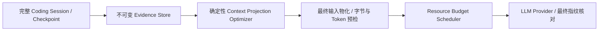

# Coding Context Projection Optimizer

版本保持 2.3.0。本轮暂停 E10 修复，针对 E02 的审批恢复后请求超限优化同一个 Unified Coding Session，不增加 Agent 或调查状态机。

## 保留与选择

- **P0**：原始 Task、最新 Plan/Approval、当前 Diff、公开失败诊断、未完成要求和宿主控制状态。重复 JSON 记录仅通过精确引用保留一个完整副本；Plan 可去除 JSON 格式空白，字段和值不变。过期宿主状态在视图中由最新可信状态替换，历史保持原样。
- **P1**：当前源码及完整 SHA、关系、相关定义和历史反证。批准目标、INSPECT 候选及宿主相关源码优先保留。容量不足时只可选择性省略较旧且明确不相关的完整读取交互；最近交互、错误、反证、变更及未知来源不按文件名猜测删除。
- **P2**：成功的过期源码输出及重复记录。以完整交互为单位选择，保持调用/结果配对。可恢复引用绑定记录身份、JSON 指针及值 SHA；原始记录始终保存在 Session 和不可变证据 artifact。

所有精确引用的原值均可验证恢复。相同文本没有因改写措辞被视为重复；当前源码没有被机械截断。省略内容不等同于不存在或已被模型观察。不能容纳必要完整记录时，在派发前保存证据与具体缺口，返回 `requestIssued=false`。

已有 `readEvidenceArtifact` 继续用于历史证据，支持 `record:<id>`、`atom:<sha>` 等宿主提供的 section。仍限 300 行 / 8 KiB；工具不可用或单行无法完整返回时须报告缺口或在预算内获取当前源码。历史读取不授予写权限，修改仍需当前源码/SHA 和已有审批。

## 同一份实际输入

第一阶段提交 `68ad259` 实现 `LanguageModelPort.prepareRequest`：配置的 Provider 使用 SDK 和现有转换函数物化最终 HTTP body，捕获步骤不委托网络，也不产生供应商请求。工具 Schema、JSON-object 输出提示、实际生成参数和工具推理续传均在物化结果中。

保留两道已有约束：原 adapter 输入 envelope 及最终 HTTP body 均不得超过配置上限。没有将旧 envelope 检查换成更宽松的口径。容量及估算采用两者字节的较大值，token 继续按现有 UTF-8 bytes / 3 向上取整，**这是宿主估算，不是供应商真实 tokenizer 数值**。输出使用配置上限，和后续必要操作一起由 Scheduler 预留，实际 usage 由回执结算。

当前 Coding 的阶段输入视图上限仍从原 `contextTokens × 3` 配置导出；输出及 Run 总 token 另行计入资源准入。没有提高 Provider、Run token/tool/step/time 上限。格式修复、输出恢复和审批消费不因投影重建重置。

最终投影携带请求身份、实际 body 指纹、guard envelope、字节及估算 token。阶段配置包装与效率记录包装透传该契约；已物化请求不能在 Scheduler 之后重新裁剪。发送前重新验证请求身份及实际 HTTP body，变化、超限或无法确认都在网络前阻断。

第二阶段提交 `8279d11` 接入 Runtime、现有证据恢复和 checkpoint。Coding 使用确定性投影，不调用 LLM 压缩；其他阶段保留原行为。完整历史、源码版本、权限、预算、截止时间以及未完成任务不由引用摘要替代。

## E02 免费验收

审计的是原始失败模型请求，身份 SHA 为 `e76d2db90e75f70bbf435167a5b1a20af03aa49f7956d1c61393797876d15db3`，没有读取私有参考补丁或把评分答案放入上下文。

原请求 messages 为 93,633 字节，工具 Schema 约 4,322 字节；两份稳定任务状态各约 24 KiB，新批准 Plan 约 12 KiB，当前源码交接约 11.7 KiB。可证实冗余包括完全一致的完整诊断记录、JSON 格式空白，以及已有版本边界标记的历史信息。

| 指标                                       |       原始 |     优化后 |
| ------------------------------------------ | ---------: | ---------: |
| 原 adapter envelope / 实际 body 的最大字节 | **98,090** | **75,114** |
| 实际 SDK HTTP body 字节                    |     98,075 |     75,099 |
| 输入估算 token                             |     32,697 |     25,038 |
| 原工具 Schema                              |       相同 |       相同 |
| 完整历史                                   |       保留 |       保留 |
| 必要记录的机械截断                         |         无 |         无 |
| 供应商真实请求                             |          0 |          0 |

回放减少约 23.4% 的请求容量，没有省略任何完整交互，仅做精确记录引用及无损格式整理。直接输入回放完成一次模拟 HTTP 派发；真实 Runtime 回放保持历史、步骤、消费与原期限。Docker 中又验证了读取 → 按完整当前 SHA 精确修改 → 提交，三个请求均低于 96,000 字节，批准外保护写入继续拒绝。

这些回放使用公开仓库、公开冻结请求、模拟 HTTP 和受控无行为修改。Runtime 消费夹具明确为合成计数，不宣称完全复原历史 Run 期限/费用，更不宣称 E02 已修复。

免费验收包含全仓 976 PASS、31 SKIP，lint、typecheck、格式及公开文件检查，以及必要信息、长会话、引用伪造、源码失效、完整交互、审批恢复、实际指纹及预算一致性回归。真实结果单独冻结记录；失败不重复付费尝试，版本不升级。

原始请求、不可变 evidence、完整账本和私有材料继续排除在 Git 外。SDK 请求拦截使用 [AI SDK 官方接口](https://github.com/vercel/ai/blob/main/content/cookbook/05-node/70-intercept-fetch-requests.mdx)；实验回放中的 JSON Schema 重建仅用于隔离脚本，不作为生产审批或 Schema 替换策略。
