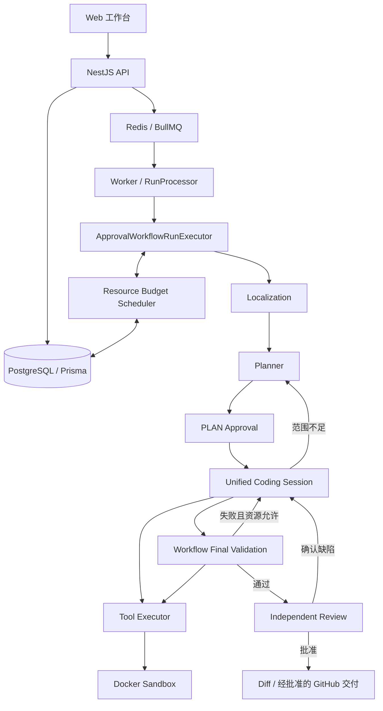

# DevFlow v2.3.1 项目整体技术报告：模块机制与源码复习

本文用于复习项目，而不是记录一次版本发布。以 v2.3.1 当前源码为依据，重点解释一次修复任务如何流转，各模块接收什么、如何处理、产出什么，以及为什么需要这些边界。实验数字和发布检查见[版本技术与验收报告](technical-report-v2.3.1-20261010.md)。

## 1. 项目究竟解决什么问题

DevFlow 把“让模型修复一个仓库问题”转化为一个可观察、可审批、可恢复的工程过程。模型能够提出定位假设、选择工具、修改代码和分析失败；DevFlow 负责固定输入版本、提供可信证据、执行工具、限制资源、验证结果及管理交付。

一次运行需要回答四类问题：

1. **定位问题**：哪些实现和消费者与 Issue 行为有关？目前依据是什么？
2. **实施问题**：哪些文件获准修改？候选实际改变了什么？
3. **正确性问题**：公开检查是否通过？是否解决 Issue？是否引入回归？
4. **运行问题**：还能调用多少资源？暂停后如何继续？错误或远端写入是否已经发生？

模型负责推理，宿主负责权威状态。“宿主”在本项目中指 DevFlow 的 Worker、Runtime、工具策略和持久化控制代码；Docker Sandbox 是宿主调用的隔离执行环境。模型说“已批准”“测试通过”或“文件没变”不会直接改变权威状态。

## 2. 先认识六个核心对象

| 对象       | 含义                                         | 为什么需要单独存在                         |
| ---------- | -------------------------------------------- | ------------------------------------------ |
| Repository | 本地或远程仓库的登记信息                     | 同一仓库可以有多个任务                     |
| Task       | 原始问题、描述及基准源码版本                 | 定义任务依据，不能用后续 Plan 替代         |
| Run        | 对 Task 的一次执行                           | 同一任务的不同尝试需要独立资源、状态和结果 |
| Approval   | 对某份计划或交付动作的批准                   | 模型建议不能自行转化为权限                 |
| Artifact   | Plan、diff、验证报告、源码证据、检查点等材料 | 保存可复查内容，不只保留一句结论           |
| Event      | 带递增序号的执行事件                         | 支持观察、补发与故障追踪                   |

Repository、Task 和 Run 不是同一个对象。Task 可以不变，但重新发起一个 Run 是新的尝试；恢复一个 Run 则必须沿用原尝试的消费和期限。

还需要区分四种身份：

- **base commit SHA**：固定仓库起点，防止任务中途跟随变化的分支漂移。
- **完整文件 SHA-256**：确认一份源码的具体字节；修改前后可精确比较。
- **workspace revision**：沙箱工作区的版本提示，不能单独代替文件内容验证。
- **请求/操作/checkpoint 身份**：识别某次动作是否已经派发、消费或保存，避免恢复时重复执行。

## 3. 总体架构：入口、编排、执行和控制



这张图描述 **Web/API/Worker 生产路径**。当前 `apps/cli` 是直接组合 Agent Runtime、Tool Executor 和 Docker 的开发入口，不是 Web 全工作流的等价 API 客户端。CLI 成功不能自动等同于经过 PLAN 审批、独立 Review 和生产评测的严格成功。

各层的工作可概括为：API 保存意图，队列安排执行，Worker 推进工作流，Runtime 驱动模型与工具交互，Sandbox 隔离仓库操作，数据库保存权威记录。

## 4. 一次任务如何完整流转

下面用通用问题“缓存更新后仍返回旧结果”举例，示例不代表任何实验的标准答案。

1. 用户登记 Repository，创建 Task。API 解析基准引用，固定完整 commit；LOCAL Run 创建时捕获不可变快照。
2. API 创建 Run 并入队。队列只传 `{runId, dispatchRevision}` 等派发信息，不承担完整状态的权威保存。
3. Worker 领取执行 Lease，读取数据库和已有检查点，确认任务未取消、派发未过期。
4. Localization 从问题提取线索，检索缓存实现、调用方和相关测试，保存真实源码与不确定性。
5. Planner 可能提出修改 `cache.ts`、检查 `service.ts`，说明验证缓存更新后的行为。宿主检查候选，形成待批准范围。
6. 用户批准 PLAN。Coding 只能在批准范围内修改；支持文件是只读证据，不因被读取自动变成可写目标。
7. Coding 读取当前源码并核对 SHA，执行精确修改，最后调用 `finishPhase` 提交候选。
8. Workflow 运行公开验证。如果失败，把失败位置、当前源码与诊断反馈同一 Session；不另开一份 Repair 预算。
9. 如果失败指向未批准的消费者，Coding 可提交范围冲突。宿主核实证据，交给 Planner 重新规划，等待新的 PLAN 审批后恢复原候选和会话。
10. 所有配置的公开检查通过后，Independent Review 判断任务相关缺陷和回归。证据不足时由宿主补证；确认缺陷时回到同一 Coding Session。
11. 最终通过后生成 diff。LOCAL 运行交付结果；GIT 运行可继续申请 push、PR 审批并发布。

审批等待会暂停派发并释放 Worker，不是在某个模型请求或进程循环里一直等待用户。

## 5. API、队列与 Worker：任务怎样可靠派发

### API 的职责

API 使用输入 Schema 校验 Repository、Task、Run、Approval 请求，通过数据库端口持久化，再投递队列。它不在 HTTP 请求线程里执行完整 Agent。

Run 创建支持 `idempotencyKey`。同一个创建请求重复到达时，复用原 Run 并检查不可变选项是否一致；LOCAL 仓库不会因为请求重放而再次读取已经变化的宿主目录。

审批结果由数据库的工作流方法处理；只有结果要求继续时，API 才用新的派发 revision 入队。取消也先写权威取消状态，再通知队列，而不是只关闭浏览器页面。

### Worker 的职责

`RunProcessor.process` 先执行 `runs.claim`，传入 Run ID、owner、Lease 期限和派发 revision。领取失败说明该任务当前不应由此 Worker 执行，直接跳过。

领取成功后，Worker 定期检查取消、续租，并将这些信号与队列信号合并。失去所有权或无法确认 Lease 时停止执行，防止两个 Worker 同时修改同一 Run。执行结果最终通过 owner 关联写回，过期执行者不能覆盖新状态。

可恢复基础设施错误可以释放运行等待队列重试；业务失败则保存明确终态。`RunRecovery` 周期性检查失效 Lease，把符合条件的运行重新派发。队列重新投递不意味着重新开始 Localization 或获得新预算。

**源码入口**：[RunsController](../apps/api/src/modules/runs/runs.controller.ts)、[ApprovalsController](../apps/api/src/modules/approvals/approvals.controller.ts)、[RunProcessor](../apps/worker/src/runs/run.processor.ts)、[RunRecovery](../apps/worker/src/runs/run-recovery.ts)、[Worker 组合根](../apps/worker/src/main.ts)。

## 6. Workflow 与 Agent Runtime 为什么分开

**Workflow 管外层业务循环**：定位、规划、审批、Coding、公开验证、Review、重新规划和交付。它决定什么时候能进入下一阶段，什么时候必须重新审批，什么时候因为资源或证据问题结束。

**Agent Runtime 管内层交互循环**：组装模型消息、生成请求、解析 Tool Call、执行工具、追加 Tool Result、更新进展、保存检查点、结束当前决策片段。

例如模型调用 `finishPhase`，Runtime 可以完成这一段模型交互，但只有 Workflow 能安排 Final Validation，并决定测试失败后是否回到 Coding。模型自己的“完成”不是整个 Run 的成功。

当前生产编排集中在 `ApprovalWorkflowRunExecutor`。`packages/workflow` 提供状态和转移契约，但其中 `DefaultWorkflowEngine.resume` 仍有 `NOT_IMPLEMENTED` 占位；不能看到这个包名就把它当作正在执行全部生产流程的引擎。

**源码入口**：[生产 Orchestrator](../apps/worker/src/runs/approval-workflow-run-executor.ts) 的 `execute`、`generatePlan`、`executeApprovedPlan`、`runAgentPhase`、`runTests`、`review`；[Agent Runtime](../packages/agent/src/runtime.ts) 的 `DefaultAgentRuntime.run`；[兼容 Workflow Engine](../packages/workflow/src/engine.ts)。

## 7. Localization：从问题描述到可追溯源码

定位包含两种相互配合的机制，不能全部归功于 LLM。

### 7.1 确定性检索与导航

`IssueLocalizer.retrieve` 从问题中提取路径、符号和行为词。Query Router 决定如何利用清单、内容索引和定向搜索。路径、符号、词法检索形成不同候选列表，使用 RRF 排名融合；明确的真实路径锚点可优先处理。

随后只读取预算允许的候选，解析真实定义和导入，构造 EvidencePack。每份证据有路径、源码范围、内容身份和来源。索引不完整、文件超限或读取失败要记为缺口，不能把“没收录”当成“不存在”。

共享导航沿真实导入、导出或符号引用寻找实现和消费者。公开测试的实际导入比模型猜测更可靠；辅助函数存在也不能证明整个行为链已经定位。

### 7.2 模型判断与有界补读

`IssueLocalizationAgent` 接收检索证据，提出行为假设、缺失证据和补读/搜索请求。宿主检查路径和额度，再返回实际观察到的内容；模型根据新增证据修订判断，最后交接候选及不确定性。

当前最多四次模型请求，输出恢复也计入；还有独立的搜索、读取与片段上限。代码中显式补读默认最多三次实际读取、六次读取尝试，每段最多 80 行/4 KiB；这些不是全工作流所有源码读取的总量，确定性导航另有预算约束。

新增且有效的源码范围、关系或有依据的候选变化才算进展。重复查询、缓存元数据变化和相同片段不算。整轮重复或连续两轮无进展会停止，避免用付费总结掩盖证据不足。

输出是定位线索而非写入授权，更不是根因证明。Planner 和 Coding 仍需检查实际实现；大仓库尤其可能需要更多消费者证据。

**源码入口**：[retrieval](../apps/worker/src/localization/retrieval.ts)、[query-index](../apps/worker/src/localization/query-index.ts)、[IssueLocalizationAgent](../apps/worker/src/localization/issue-localization-agent.ts)、[implementation-navigation](../apps/worker/src/localization/implementation-navigation.ts)、[evidence-projection](../apps/worker/src/localization/evidence-projection.ts)。

## 8. 关系图：提供导航，不替代行为证据

关系图把文件、包、导入、转发和可解析定义组织成可查询 artifact。TS/JS 使用 AST 解析并处理别名、barrel、workspace 包和循环；Python、Java、C++ 使用有界静态/词法单元，动态绑定等关系可能无法解析。

图中不是只有“有边/没边”：文件可为 `CURRENT`、`STALE`、`UNREAD` 或 `UNAVAILABLE`；关系可为 `RESOLVED`、`EXTERNAL`、`UNRESOLVED` 或 `DYNAMIC`。边绑定来源源码 SHA 和配置身份，避免旧关系被当成当前事实。

`queryRelations` 可用于寻找 API 的实现、文件依赖、调用相关定义及消费者。查询结果必须继续配合源码范围理解行为：一条 import 只证明依赖，不证明运行时一定经过某分支。

修改影响路径后，图和源码缓存相应失效。未知命令可能改变任何文件，需要保守失效；同版本缓存命中减少真实读取，但不算新发现。

这些能力是内置工具接口，不要求 Agent 通过独立 MCP Server 获取；Skill 也不是图数据的权威来源。Review 自身不直接调用工具，而是请求宿主补证服务使用共享导航。

**源码入口**：[relation-graph](../apps/worker/src/localization/relation-graph.ts)、[relation-parser](../apps/worker/src/localization/relation-parser.ts)、[relation-query](../apps/worker/src/localization/relation-query.ts)、[source-units](../apps/worker/src/localization/source-units.ts)。

## 9. Planner 与 Approval：提案怎样变成权限

Planner 是只读规划者，输出简短 `PlanProposal`：

| 字段             | 用途                                             |
| ---------------- | ------------------------------------------------ |
| `decision`       | `PROPOSE` 或 `UNKNOWN`                           |
| `goal`           | 要解决的可观察行为                               |
| `approach`       | 修复方向及待验证假设                             |
| `candidateFiles` | 路径、`INSPECT`/`EDIT` 意图和理由；符号/引用可选 |
| `verification`   | 需要验证的行为或测试                             |
| `uncertainties`  | 当前仍未确定的事项                               |

这里没有要求模型提供精确函数、可信度或步数预测。`EDIT` 表示打算修改，不代表已经证明根因，也不直接授予写权限；`INSPECT` 表示只读支持。全部是 INSPECT 的提案只能走有界调查，不能直接进入写代码。

宿主将提案转成审批范围：检查路径、文件存在性、CREATE/MODIFY 意图和保护规则；受保护测试的写入建议不会进入可写范围。内部兼容的 `executionContract` 由宿主生成，不能把它误认为仍要求模型输出旧版复杂契约。

PLAN 审批批准的是具体版本的修改范围。模型可在批准文件内选择更合适的局部实现，但增加新目标必须重新规划和批准。保护规则也不会被人工批准的一句文本自动解除。

原始 Issue 定义任务，Plan 只是解释：Planner 提出的未经证实额外场景不能自动扩大验收要求。当前使用一次既有只读补查，没有完整多轮 Planner 调查状态机。

**源码入口**：[PlanAgent](../apps/worker/src/runs/plan-agent.ts)、[Plan 上下文](../apps/worker/src/runs/plan-agent-context.ts)、[提案转换与审批范围](../apps/worker/src/runs/plan-proposal.ts)。

## 10. Unified Coding Agent Loop：Execute 和 Repair 如何统一

统一不是把测试也变成模型说了算，而是把**连续代码决策**放在同一逻辑会话里。

Worker 的 `CodingSession` 持有 Runtime、AgentState 和当前沙箱关系图；`save` 检查累计步骤和 token 不得倒退，再调用持久化回调。AgentState 保存消息、计划、工具状态、源码证据、进展、纠正额度及提交结果。

每轮内层交互大致执行：

```text
加载/延续 AgentState
  → 构造当前任务、批准范围、失败反馈和工具视图
  → 上下文投影及预算准入
  → 请求 LLM
  → 校验返回；截断输出不执行部分动作
  → 执行合法 Tool Call，记录结果与变更
  → 更新实际进展并保存状态
  → 继续局部决策，或 finishPhase 提交
```

公开验证失败时，Workflow 用 `HostCodingContinuation` 注入 `PUBLIC_VALIDATION` 反馈。Review 确认缺陷使用 `INDEPENDENT_REVIEW`；新 PLAN 审批使用 `APPROVAL`。这些反馈有稳定 ID 和指纹，相同反馈不会重复重开会话；只有新 APPROVAL 能替换批准计划。

连续性指同一份逻辑历史和消费，不保证审批前后仍使用同一个容器。新容器恢复必须重新核对候选与身份。

### 什么时候继续，什么时候停止

- 写入成功且 diff 合法，进入稳定候选状态；不能凭此清空任务要求或强制结束。
- 有效 `finishPhase` 是提交事件，立即返回 Workflow，不追加“再确认一下”的模型调用。
- 重复读取、相同 diff、解释换措辞不算进展；连续两轮无进展停止。
- 历史候选指纹用于识别来回振荡，恢复不能清零计数。
- 预算不足时停止派发，保存候选和未完成要求；这不是完整成功。
- Test/Review 的失败可在剩余次数和资源内回到原 Session；原 `REPAIR` 指标只是兼容标签。

**源码入口**：[Worker CodingSession](../apps/worker/src/runs/coding-session.ts)、[continueCodingSession](../packages/agent/src/coding-session.ts)、[AgentState](../packages/agent/src/state.ts)、[进展判定](../packages/agent/src/evidence-progress.ts)、[修复任务反馈](../apps/worker/src/runs/repair-tasks.ts)。

## 11. Tool Registry、Policy 与 Executor：模型怎样真正操作代码

Registry 保存工具的名称、描述、输入/输出 Schema、权限、超时和执行函数。模型看到的是描述与参数 Schema；执行函数留在宿主，不会交给模型。

一次 Tool Call 的执行顺序是：查 Registry → 记录 TOOL_CALL → Policy 检查 → 输入 Schema 校验 → 合并任务取消和工具超时 → 在 Sandbox 执行 → 输出 Schema 校验 → 记录 TOOL_RESULT。未知工具、权限不足、错误参数或执行异常分别返回结构化错误。

基础工具包括文件浏览/读取、搜索、精确替换、补丁和 Git 操作；Worker 再组合共享图查询、证据恢复和 `finishPhase` 等阶段能力。动态工具契约依据当前有效 Runtime 策略生成，不能显示一个宽参数上限却在宿主隐藏拒绝。

### 编辑为何要完整 SHA

`replaceText` 默认要求精确文本唯一匹配，并使用当前完整 SHA；`applyPatch` 保留较复杂补丁能力。显式 `MATCH_FILE` 可处理均一 LF/CRLF 等价匹配，但混合换行、重复匹配和过期 SHA 不会被猜测修正。

SHA 防止模型基于旧片段覆盖新源码；唯一匹配防止改错同名代码。写入后还需 diff/当前身份核实，不能仅凭工具返回成功就交付。

### 参数错误怎样恢复

`queryRelations.paths` 传字符串会被拒绝，不会自动变成数组。错误返回字段路径、期望类型、实际类型、有效 Schema 和合法结构，模型可在一次有界纠正中显式提交新参数。

参数纠正与编辑格式/LENGTH 恢复共享现有一次信用。纠正状态在请求前保存；无效调用仍不算进展，合法但重复的查询也可能停滞。权限拒绝和探索耗尽不是参数格式错误，不能借纠正重新获得权限或预算。

**源码入口**：[Registry](../packages/tools/src/registry.ts)、[Executor](../packages/tools/src/executor.ts)、[Policy](../packages/tools/src/policy.ts)、[builtins](../packages/tools/src/builtins.ts)、[replaceText](../packages/tools/src/replace-text.ts)、[参数错误诊断](../packages/tools/src/input-validation.ts)。

## 12. 源码缓存、变更观察与证据失效

缓存的价值是少做真实 IO，并保留已核实源码；不能用来绕过当前源码确认。缓存必须关联仓库/沙箱、文件路径及完整 SHA。

| 宿主观察                            | 对证据的处理                       |
| ----------------------------------- | ---------------------------------- |
| 操作被拒绝，且完整确认未执行/未变化 | 保留有效证据                       |
| 实际修改已确认                      | 失效受影响路径的旧片段、SHA 和关系 |
| 工具失败，但实际已经修改源码        | 按实际变更处理，不能保留旧版本     |
| 删除已确认                          | 使用明确的 `ABSENT` 身份           |
| 中断、部分观察或未知命令执行        | 保守失效，后续重新核实             |

任务要求和源码证据需要分开：修改源码可以使旧引用失效，但不能删除“尚需修复草稿恢复”等稳定要求。失败反馈、finding ID 和未完成项应持续存在。

**源码入口**：[CurrentSourceCache](../apps/worker/src/runs/current-source-cache.ts)、[Runtime working-set](../packages/agent/src/working-set.ts)、[Worker working-set](../apps/worker/src/runs/working-set.ts)、[Sandbox 读取](../packages/sandbox/src/read-file-content.ts)。

## 13. Context Projection Optimizer：长会话怎样装进请求

完整历史是档案，模型当前视图是选择结果，两者不能混为一谈。Coding 投影走三层：

| 层级 | 内容                                                         | 处理原则                         |
| ---- | ------------------------------------------------------------ | -------------------------------- |
| P0   | Task、当前批准计划、diff、失败诊断、未完成要求、可信控制状态 | 必须保留权威内容                 |
| P1   | 当前源码/SHA、相关定义和关系、历史反证                       | 按相关性保留完整记录             |
| P2   | 精确重复、成功的过期读取、失效控制提示                       | 去重、引用或省略可恢复的完整交互 |

`ContextEvidenceStore` 保存原消息和可引用原值；投影中的记录/atom 引用包含身份与内容 hash。`readEvidenceArtifact` 可以在工具可用且预算允许时恢复材料。恢复旧记录仍不授予写权限。

Coding 使用确定性处理，不运行 LLM 摘要。精确重复可共享一个原值，过期控制提示由当前可信状态替换；不能靠截半个 JSON、截断关键函数或删掉必要反证让请求通过。必要内容装不下就报告缺口。

最终容量不只看 prompt 文本。`LanguageModelPort.prepareRequest` 使用同一 SDK 转换函数零网络物化最终 HTTP body，包括 Tool Schema、输出模式和实际参数。Scheduler 用这份请求报价，Provider 派发前再次核对指纹。输入 envelope 和最终 body 都检查原限制，不在报价后重新裁剪。

Token 预检使用 UTF-8 bytes/3 的宿主估算，实际结算来自 Provider usage；不能把估算数当成真实 tokenizer 输出。思考与最终回答共享配置输出额度。

**源码入口**：[context-projection](../packages/agent/src/context-projection.ts)、[model-budget](../packages/agent/src/model-budget.ts)、[SDK Adapter](../packages/agent/src/vercel-ai-model.ts)、[Coding 历史投影](../packages/agent/src/coding-session.ts)。

### 13.1 模型适配与阶段配置怎样组合

Runtime 依赖 `LanguageModelPort`，不直接依赖某个供应商客户端。Worker 读取全局 `LLM_*` 和阶段 `LLM_LOCALIZATION_*`、`LLM_PLANNER_*`、`LLM_EXECUTE_*`、`LLM_REVIEW_*`，创建具体模型 Adapter，再包装阶段约束、请求审计和资源计量。

`ModelRequest` 携带消息、工具描述和生成配置；Adapter 将它们转换为 SDK 请求，返回统一的文本、Tool Call、结束原因和 token usage。模型只声明想调用工具，真正执行仍回到 Runtime 和 Tool Executor。

阶段字段为空时继承相应全局/Run 设置，显式覆盖优先。换供应商或 endpoint 时必须正确提供对应凭据，不能把原平台 API key 自动转发给其他平台。`.env` 保存本地凭据，`.env.example` 只提供公开示例。

| 活跃阶段          | 公开示例模型               | 思考 | 输出 / 上下文 token 上限 |
| ----------------- | -------------------------- | ---- | ------------------------ |
| Localization      | 全局 `deepseek-v4.1-flash` | 关闭 | 4,096 / 32,000           |
| Planner           | `deepseek-v4-pro-0813`     | high | 8,192 / 32,000           |
| Coding（EXECUTE） | `glm-5.3`                  | low  | 8,192 / 32,000           |
| Review            | `deepseek-v4-pro-0813`     | high | 16,384 / 64,000          |

示例统一百炼兼容接入；用户可替换模型，DevFlow 负责契约和预算，不保证模型一定正确。旧 `LLM_REPAIR_*` 可以读取，但统一 Coding 的后续修复仍使用 EXECUTE 绑定。CLI 开发入口使用自己的全局模型组合，不能默认等同于 Worker 的阶段接入。

**源码入口**：[阶段配置](../apps/worker/src/config/stage-models.ts)、[阶段包装](../apps/worker/src/runs/stage-language-model.ts)、[Model Port](../packages/agent/src/model.ts)、[公开配置](../.env.example)。

## 14. Resource Budget Scheduler：如何避免半途没有验证资源

Scheduler 解决的不只是“有没有达到上限”，还包括“执行这个可选操作后，是否仍有能力完成必要路径”。

它把计划表达为三类结构：`OPERATION` 表示一项操作，标注必要/可选及待做/缓存/已完成；`SEQUENCE` 累计顺序成本；`EXCLUSIVE` 描述真正互斥的分支，共享后续成本只计一次。

例如继续探索与当前候选提交是两条备选路径，但一次修复后再验证是顺序路径。不能对顺序执行使用 max 来少算，也不能把普通完成和范围重新规划的共同 Review 重复相加。报价必须依据当前真实请求与实际操作清单，而不是默认最多八次读取就报价必需八次。

四个接口各自承担不同职责：

| 接口      | 作用                                               |
| --------- | -------------------------------------------------- |
| `quote`   | 计算需求、可用容量、可省略项与缺口，不派发         |
| `reserve` | 持久化容量预约和操作身份，避免其他路径重复占用     |
| `admit`   | 在派发前领取该操作执行资格；不能重复执行已领取动作 |
| `settle`  | 以实际 usage 一次性结算，保存结算身份与估算差异    |

Ledger 分别记录 tokens、模型调用、步骤、逻辑工具、内部执行、IO 次数/字节、时间和费用。**缓存命中可能仍是一项逻辑 Tool Call，但不应伪装成物理读取**；内部 IO 也不能直接相加成逻辑调用数。

`ResourceBudgetRuntime` 在模型、Sandbox、IndexSource 和 stateStore 边界接入这些计量。累计 Session 指标通过 delta 转入工作流，避免每次延续都重新加整个历史 token。

持久化使用 `BudgetLedgerStore`；当前 Prisma 实现把带 revision 的账本保存在 `Run.metadata.resourceBudgetLedger`，通过整份 metadata 的 CAS 防止并发覆盖其他状态。它不是一个另建的 BudgetLedger Prisma 表。

未知回执不能伪造 settlement：保留 token/费用相关预留并记录不确定性。资源不足时先裁减可选操作，必要路径仍不足则阻断，记录所缺维度及 `requestIssued=false`。重新审批不延长绝对期限或恢复新额度。

**源码入口**：[Scheduler](../apps/worker/src/runs/resource-budget-scheduler.ts)、[边界计量](../apps/worker/src/runs/resource-budget-runtime.ts)、[Coding 路径预留](../apps/worker/src/runs/coding-budget.ts)、[Replan 操作清单](../apps/worker/src/runs/replan-operation-plan.ts)、[Prisma Ledger Store](../packages/database/src/prisma-adapter.ts)。

## 15. Final Validation：谁决定测试通过

Workflow 持有公开验证 profile，按 build、typecheck、lint、test 顺序运行。npm 项目从现有脚本发现；其他项目可由可信宿主提供有公开来源的命令，兼容发现还保留部分旧测试入口。

一次 profile 共享最多 300 秒及 Run 剩余额度，每个实际命令前再预检。首个失败停止后续命令，分别保存 `FAIL`、`NOT_RUN`、`NOT_CONFIGURED`；退出码、超时和输出截断均参与判断。

报告保留命令、profile hash、当前源码身份、stdout/stderr 和诊断。只有配置的必要检查都通过才进入 Review。模型自己运行的命令是证据，不能替代 Workflow 的最终验证。

诊断解析把 TS/JS、Python、Java、C++ 错误定位到真实仓库路径，优先精确位置和最近项目帧；框架/JDK 栈先过滤，同名歧义不猜测。当前诊断种子有界读取，原始完整日志以 artifact 保存。

稳定失败指纹只剥离已识别报告器的耗时噪声，保留断言、失败 ID、位置、超时和截断。相同源码、依赖和 profile 下的相同失败，不因耗时改变变成新进展，也不应无条件重复跑整组测试。

**源码入口**：[public-verification](../apps/worker/src/runs/public-verification.ts)、[repair-diagnostics](../apps/worker/src/runs/repair-diagnostics.ts)、[repair-convergence](../apps/worker/src/runs/repair-convergence.ts)。

## 16. Independent Review：为什么测试通过后还要审查

公开测试只覆盖已经写下的场景，Review 需要判断 Issue 行为、补丁回归和源码证据之间是否一致。它与 Coding 分离，不能自己编辑或直接执行工具。

输入包括原始 Task、Plan 解释、基准/当前源码、累计 diff、验证报告、历史 finding 与 Coding 答复。未展示的源码范围明确为未知，不能用“片段中没看到”证明实现不存在。

裁决有三种主要情况：`PASS` 表示没有未关闭的阻断问题；`FAIL` 表示有证据支持且可行动的任务相关缺陷；`NEEDS_EVIDENCE` 表示关键条件尚未核实。建议不阻断；有依据的无关既有缺陷可以 `DEFERRED`，不要求本次任务修复。

宿主管理 finding ID、来源校验和阻断状态。旧 finding 在新结果中被遗漏不等于关闭；Coding 声称 `ALREADY_SATISFIED` 或 `CONTRADICTED` 后，也由独立 Review 核对当前 SHA 和引用。

### 宿主补证如何运作

Review 返回有界源码请求或公开复现请求，Worker 查询共享图/当前源码，或在受限只读环境执行相同的基准与候选脚本，然后把观察及失败原因交回 Review 再判断。全流程共享补证轮次、读取和复现额度，恢复不重置。

公开 JS/TS 复现使用 `assertBehavior(ok, expected, actual)` 表达行为观察。脚本错误、依赖缺失、超时或无有效断言不能凭非零退出码当作缺陷；候选反例实际通过时，Review 必须处理这份反证。宿主不自动改写断言来制造结果。

截断回答即使可解析，也不视为完成裁决；语义恢复使用紧凑证据和 low 思考，完整答案的格式修复则是无思考转换。它们共享持久化恢复额度和原 Run 资源。

**源码入口**：Orchestrator 的 `review`，以及[review-evidence](../apps/worker/src/runs/review-evidence.ts)、[review-supplement](../apps/worker/src/runs/review-supplement.ts)、[review-probes](../apps/worker/src/runs/review-probes.ts)、[readonly-probe](../packages/sandbox/src/readonly-probe.ts)。

## 17. Replan：范围不足怎样合法扩大

重新定位和写入权限分开。连续公开失败可以在条件满足时打开一次有界只读调查；读到范围外实现不等于能修改。

有效范围冲突的处理链是：公开失败 → 宿主解析诊断并核实当前测试/候选原文和完整 SHA → 将关联作为假设交给 Planner → 新 PLAN 审批 → 恢复累计候选与 Session → 继续 Coding。

宿主不用证明完整调用链才能允许只读调查，但候选存在或模型声明本身也不授予权限。伪造引用、过期 SHA、路径歧义、无有效失败或资源不足都应给出具体阻断原因。

全工作流最多一次 Replan，最多两次 Planner 请求含格式纠正，使用原任务资源。普通用户任务等待审批；可信 benchmark 按已记录策略批准，不是模型自批。

等待前保存实际累计变更，包括创建/删除文件、基准和当前 SHA、旧批准范围、未完成诊断及 Coding Session 关联。恢复可能创建新沙箱，先固定基准，再恢复实际变化并复核；零修改候选也需验证干净身份，不能凭旧批准文件列表恢复。

第二次冲突、审批拒绝、候选身份不一致或容量不足会明确结束，不能新建 Session 绕过限额。

**源码入口**：[scope-replanning](../apps/worker/src/runs/scope-replanning.ts)、[replan-evidence](../apps/worker/src/runs/replan-evidence.ts)、[replan-operation-plan](../apps/worker/src/runs/replan-operation-plan.ts)、[候选读取](../apps/worker/src/runs/replan-source.ts)。

## 18. Sandbox、Git 与 GitHub：执行安全和交付安全

Docker Sandbox 用非 root 用户及 `/workspace` 隔离不可信仓库，限制 CPU、内存、进程、网络、时间和输出。命令通过 program/args 契约执行；路径和 symlink 检查限制仓库外访问。平台凭据不进入 Agent 可用环境。

远程仓库在沙箱中固定基准；LOCAL 使用已保存的不可变快照。`SandboxGitService` 封装 diff/status 等仓库操作；diff 需要关联基准和候选身份，作为验证和最终交付材料。

GitHub 的平台 REST Provider 在宿主边界使用凭据。Push 和 PR 分别需要审批；`GitHubPublicationCoordinator` 使用稳定 operation key、已保存发布记录及远程标记对账。若远端写入可能成功但响应丢失，恢复先核实远端，不盲目再创建一个 PR。

本地取消不能假装撤销已发生的远端写入，因此远端可能接受写入后仍有一个有界对账区间，先记录实际结果再返回。

**源码入口**：[DockerSandboxManager](../packages/sandbox/src/docker-sandbox-manager.ts)、[Sandbox 契约](../packages/sandbox/src/contracts.ts)、[SandboxGitService](../packages/git/src/sandbox-git-service.ts)、[GitHub Coordinator](../packages/github/src/coordinator.ts)、[REST Provider](../packages/github/src/rest-provider.ts)。

## 19. 持久化、事件与前端：故障后还能知道发生了什么

持久化有不同用途：数据库保存 Run/Approval 等权威业务记录；Artifact 保存计划、候选、报告及检查点；AgentState 保存完整会话；Budget Ledger 保存消费和未结算动作。Event 则提供可补发的执行轨迹，不能独自替代全部状态。

Worker 的 Coding 状态通过回调保存为 `coding-session-v1.json` artifact；本地开发 CLI 使用 `JsonFileAgentStateStore`。不要把 CLI 文件检查点、数据库 ledger 和生产候选检查点当成同一存储机制。

恢复检查 Run 派发、Lease、基准、候选 SHA、审批关联、Session 和已用额度。不能确认中断请求结果时保持阻断或保留未知费用，不能推断为“没执行”。同样不能仅凭旧 `PATCH_READY` 标签就跳过有效提交证据。

Web 查询 Run Detail，再加载事件历史并订阅 SSE。事件按 Run 的递增 sequence 排序；重连带 `afterSequence` 或 `Last-Event-ID` 补发缺口，前端按 sequence 去重。heartbeat 表示连接还活着，终态 `stream-end` 关闭流。

页面应区分“正在做什么”“为什么停止”和“结果是否通过”。例如 `requestIssued=false` 是宿主预检阻断，不是模型回答错误；未进入 Review 也不是 Review 拒绝。

**源码入口**：[Prisma Schema](../packages/database/prisma/schema.prisma)、[Database 端口](../packages/database/src/contracts.ts)、[Prisma Adapter](../packages/database/src/prisma-adapter.ts)、[SSE Service](../apps/api/src/modules/runs/run-event-stream.service.ts)、[useRunEvents](../apps/web/src/hooks/use-run-events.ts)、[run-detail](../apps/web/src/components/run-detail.tsx)。

## 20. Benchmark 与严格成功：怎样知道系统真的修好了

评测 Runner 冻结输入、执行 profile、基准、评分规则和模型身份，调用 EvaluationTarget 运行任务，再对观察评分和保存来源。公开验证是模型可用的工程反馈；独立评分器及参考答案不能进入模型上下文。

至少需要分开报告：工作流是否成功、公开验证是否通过、Issue 独立验收、原测试回归、保护/完整性和独立 Review。只通过 Issue 复现但原测试失败，不能称严格 PASS。

`scoreEvaluation` 合并 Run 成功、工作流测试、评测规则和 integrity；生产 Run 的成功包含其工作流裁决，但具体验收仍要报告 Review 结果，不能从某一个分数倒推所有阶段。

还要分开模型决策尝试、实际 HTTP 与已结算请求。预检未派发可以增加尝试计数，但不能当成一次模型调用费用；未知回执也不能假装已经结算。

当前小样本证明有限任务能力，不能代表任意仓库稳定成功率。复杂消费者定位、行为修复完整性和必要继续路径资源仍是已知短板，详见发布报告。

**源码入口**：[Evaluation Runner](../packages/eval/src/runner.ts)、[scorer](../packages/eval/src/scorer.ts)、[integrity](../packages/eval/src/integrity.ts)、[排队评测入口](../apps/worker/src/runs/queued-benchmark-gateway.ts)。

## 21. 项目的关键设计取舍

| 设计                               | 获得什么                        | 需要承担什么                                 |
| ---------------------------------- | ------------------------------- | -------------------------------------------- |
| 确定性宿主 + 推理模型              | 权限、版本和消费可核查          | 宿主编排本身需要完整回归，错误预检会阻断能力 |
| 短 Plan + 人工范围审批             | 降低输出复杂度，明确写入边界    | 根因不确定时可能需要一次 Replan              |
| 统一 Coding Session                | 失败反馈、反证和任务连续保留    | 长历史需要投影，重复预算需精确处理           |
| 静态图 + 有界源码读取              | 减少盲目全仓扫描                | 图不完整，跨语言和动态调用仍有盲区           |
| 确定性上下文投影                   | 可追溯，不引入摘要幻觉          | 不能把所有大仓证据都塞入一次请求             |
| 硬预算 + 下游预留                  | 防止无界成本和没有验证资源      | 报价过粗、过晚或重复可能让有效修复无法继续   |
| Workflow 验证 + Independent Review | 模型不能自行宣称验收通过        | Review 也需要完整证据和恢复机制              |
| checkpoint + 幂等身份              | 崩溃/审批后恢复不重做已完成动作 | 身份与消费不确定时必须保守阻断               |

## 22. 按这条路线复习源码

先用约 30 分钟读第 1–6、10、14–17 节，画出“业务状态、模型交互、资源准入”三条线。然后按以下顺序进入源码，避免一开始陷入巨大 Orchestrator 的所有分支：

1. **入口到派发**：RunsController → BullRunQueue → RunProcessor → ApprovalWorkflowRunExecutor。
2. **定位到授权**：IssueLocalizer → IssueLocalizationAgent → PlanAgent → plan-proposal → ApprovalsController。
3. **工具交互**：CodingSession → DefaultAgentRuntime → Tool Registry/Executor → SandboxSession。
4. **请求与预算**：context-projection → model-budget/prepareRequest → ResourceBudgetRuntime → Scheduler → BudgetLedgerStore。
5. **失败闭环**：runTests/public-verification → repair-diagnostics/repair-tasks → HostCodingContinuation → 原 Runtime。
6. **范围与独立裁决**：scope-replanning/checkpoint → 新 PLAN 审批 → review-evidence/supplement/probes → GitHub Coordinator。

每读一个模块，都尝试回答：“输入有哪些可信状态？哪些内容是模型假设？哪一步有实际副作用？执行前保存了什么？恢复后如何避免重复？错误会反馈给谁？”

### 自测问题

1. 为什么 PostgreSQL 和 BullMQ 同时存在？队列过期消息怎样避免执行？
2. Task、Run、Coding Session 和 Sandbox 容器分别代表什么？
3. 为什么读取范围外源码不等于可以修改？新 PLAN 审批批准了什么？
4. 为什么一份合法 Plan 或合法 diff 不能代表修复正确？
5. 测试失败如何反馈同一个模型会话？哪些状态不能被重置？
6. 完整历史、当前模型视图和源码缓存有何区别？
7. SHA、revision 和 checkpoint 指纹分别解决什么问题？
8. 为什么 Scheduler 需要检查必要下游路径，而不是只检查当前请求？
9. Tool Schema 错误、权限拒绝、探索耗尽和真实停滞怎样分别处理？
10. 为什么 Review 不直接调用工具仍能形成补证闭环？
11. 远端写入成功但本地响应丢失时，GitHub 交付怎样避免重复？
12. Issue PASS、原测试 PASS、Run SUCCEEDED、Review PASS 和严格 PASS 为什么不能混用？

能沿真实代码解释这些问题，就掌握了当前 DevFlow 的主要架构；模型名称、历史成功次数和单次参数只是运行配置，不是项目设计本身。
