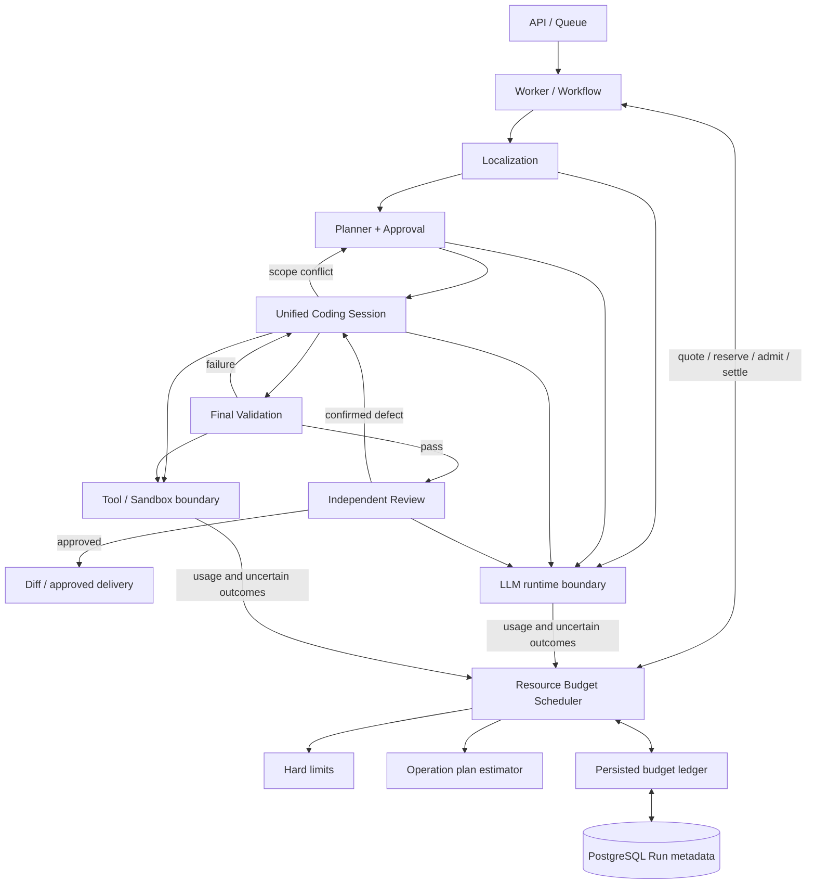

# Resource Budget Scheduler

The Worker uses a Run-scoped Resource Budget Scheduler to admit model requests and repository operations against a persisted ledger. It retains the Unified Coding Session, public final validation, independent Review and new PLAN approval before expanding write scope.

The package remains **2.3.0** during this work. Promotion to **2.4.0** requires engineering acceptance and an E10 real, complete workflow that passes public validation, independent Issue/original-test/integrity checks and Review. Controlled model replay establishes orchestration behavior; it does not establish real model repair capability.

## Architecture



| Layer              | Responsibility                                                                                                                                    |
| ------------------ | ------------------------------------------------------------------------------------------------------------------------------------------------- |
| Hard limits        | Retain Run token, logical-tool, step and absolute-time limits; optionally enforce internal-execution, byte and priced-cost limits.                |
| Dynamic allocation | Quote the current serialized request and remaining operation paths; reuse verified evidence and omit optional work when capacity is insufficient. |
| Runtime accounting | Reserve before dispatch, record actual observable usage once, and preserve unresolved request exposure across interruption and approval.          |

With the existing configuration, a task has **25 steps, 75 logical tool calls, 250,000 tokens and 25 minutes**. The logical-tool default is derived from the Run step limit; explicit task/configuration limits still apply. This refactor does not raise those limits or the repair allowance. Stage output/context settings also remain unchanged.

## Operation plans

An operation describes its identity, requirement (`REQUIRED` or `OPTIONAL`), state (`PENDING`, `CACHED` or `COMPLETED`) and estimated resource vector. Cached and completed work remain visible in the plan but add no future execution charge. A cache claim must be established by the owning component; marking an operation cached cannot bypass source or permission checks.

- `SEQUENCE` adds every child: preparation, a model decision and its following validation are sequential costs.
- `EXCLUSIVE` requires an explicit workflow transition identity. Only mutually exclusive alternatives use `shared + max(branches)` for each resource dimension.
- Common downstream validation and Review belong in the shared component once. A second validation that actually follows a failed one remains a separate operation.
- Quoting can remove optional leaves and records their IDs. If required work still does not fit, admission fails with the remaining capacity and shortfall.

The Worker recomputes the relevant path as evidence, changed files and task state evolve. Future estimates describe the current reachable plan, not a promise that arbitrary additional targets can fit. Operations at the integrated model, Sandbox and source boundaries pass admission before dispatch; the accounting boundaries below describe the remaining coverage limits.

Request estimates use the messages and structured schema that will actually be dispatched, together with the configured output maximum and request deadline. The host does not lower the model's output setting to make a request fit. Reported output usage already includes reasoning where supplied by the provider; it is not charged a second time as a separate reasoning budget.

## Admission, persistence and recovery

The public Scheduler lifecycle is:

```text
quote(plan)
  -> reserve(operationId, plan)  # persist capacity before dispatch
  -> admit(operationId)          # recheck current limits and deadline
  -> execute
  -> settle(operationId, actualUsage)
       or markUncertain(operationId, knownUsage, reason)
```

`quote` is a projection. `reserve` holds capacity without claiming that it was consumed. `admit` has a single compare-and-swap winner; an already admitted or settled operation is not dispatched again on recovery. `settle` adds actual usage once. Repeating the same settlement is idempotent; supplying a different settlement for the same operation is rejected.

The PostgreSQL adapter stores a versioned ledger in `Run.metadata.resourceBudgetLedger`. Its compare-and-swap checks the previous metadata value and ledger revision while preserving unrelated metadata. The ledger retains consumed usage, reservations, unknown-price status, estimate variances, violations and the latest admission decision. Budget persistence does not require a separate database table.

A returned request uses reported input/output usage for settlement. If a locally invoked provider request ends without reliable usage, `markUncertain` records known invocation/time facts and retains the unresolved token/cost reservation. It does not invent a zero bill or hold a second copy of already elapsed request time. Only a reservation that has not been admitted can be released as unexecuted work.

A trusted local adapter error with `requestIssued=false` establishes that no provider request was sent. It settles zero tokens and cost while retaining the local invocation attempt and elapsed time. Before the adapter returns, telemetry records `INVOKE/PENDING`, not a confirmed HTTP dispatch. Unknown transport failures continue to hold their exposure. `modelCalls` counts adapter invocation attempts, so actual HTTP receipts must be reported separately.

On resume, the saved start, absolute deadline, consumed usage and reservations remain authoritative. Changing the configured hard limits cannot silently enlarge a persisted ledger. Interrupted in-flight operations remain held rather than being replayed with a fresh allowance. Coding decision identities prevent duplicate step settlement for the same checkpoint. External HTTP and a Coding checkpoint are not one transaction: the ledger does not promise exactly-once provider execution, and an unknown prior request remains held if recovery attempts another decision. Legacy usage that was not measured at an internal IO boundary is not retroactively presented as exact measurement.

If actual usage exceeds its estimate, settlement records the variance. A real hard-limit violation is recorded and blocks further admission; it is not hidden by clamping the recorded usage to the estimate. Preflight estimates reduce this risk but cannot turn an unreported external bill into a known value.

## Accounting boundaries

The ledger separates the following dimensions:

| Dimension                               | What is measured                                                                                                                 |
| --------------------------------------- | -------------------------------------------------------------------------------------------------------------------------------- |
| `tokens`, `inputTokens`, `outputTokens` | Reported LLM usage after dispatch; serialized input/configured output before dispatch.                                           |
| `modelCalls`                            | Actual model invocation attempts, distinct from an Agent decision checkpoint.                                                    |
| `logicalToolCalls`                      | Existing Agent/host logical-call policy, including denied, cached or control-tool calls where that policy applies.               |
| `toolExecutions`                        | Executions at the wrapped Sandbox or external source boundary, including nested host operations.                                 |
| `ioReads`, `ioWrites`                   | Repository/source reads and writes at those boundaries.                                                                          |
| `ioBytes`                               | Returned source/command-output bytes and submitted write/patch bytes; uncertain failed operations retain conservative estimates. |
| `steps`                                 | Persisted workflow/Agent decision consumption.                                                                                   |
| `timeMs`                                | Observable operation duration, with Run admission governed by its saved wall-clock deadline and necessary future time.           |
| `costMicros`                            | Token usage multiplied by configured rates in millionths of one chosen currency. Missing rates remain `UNPRICED`.                |

A Sandbox `exec` is one internal execution; its child process system calls are not individually counted. `readFile` is an execution plus a read; `writeFile` and `applyPatch` are executions plus a write. A file listing is a read operation but does not pretend to have loaded every listed file's content. Initial snapshot acquisition, initial repository-source setup and Sandbox creation occur before these wrappers, so their underlying IO is not itemized in this ledger. Database writes for ledger/events/checkpoints are not repository IO. Mandatory Sandbox disposal remains possible after a deadline and grants no editing capacity. These metrics are not a measurement of all disk or network activity.

Source adapters identify the accounting owner. A verified in-memory snapshot has `resourceIOOwner: MEMORY` and causes no physical read charge. A source backed by the wrapped Sandbox has `resourceIOOwner: SANDBOX`, so the outer adapter does not charge the same operation again. Other external sources are measured at their own adapter boundary. Memory reuse is not new evidence or model progress.

The historical `toolExecutions` metric omitted some internal host operations. Its values are **not directly comparable** to the new boundary-based count. Reports should show logical calls, internal executions and IO separately, alongside actual provider request counts. Removing duplicate IO must remove the real operation, not merely its accounting entry.

## Replanning and source reuse

Replan admission uses an explicit list of candidate verification, necessary public-failure evidence, checkpoint capture, restore validation, diagnostic context, editing/correction/submission, public checks, Review and delivery operations. Required Review context remains required; optional supplementary exploration is represented separately. A public verification profile already supplied by the trusted host does not require rediscovering its commands.

Checkpoint work depends on actual cumulative changes, including new and deleted files. The prior approval scope is stored separately; an approved but unchanged file does not need a checkpoint write. A clean candidate still requires baseline and clean-state verification. Before an edit can enlarge the changed set, the Worker requotes the corresponding checkpoint/restore branch, including the second file when applicable.

Replan source preparation retains its eight-read, 512 KiB-per-file, 1 MiB-total and 16 KiB-snippet bounds. Necessary failure and candidate evidence takes precedence over optional navigation. Repair context selection uses the same diagnostic paths in estimation and execution, rather than substituting the number of candidate files. Public checks retain their individual command identities and costs.

The current-source cache is owned by one Sandbox and stores complete, SHA-verified content. Verified current content and immutable baseline content can avoid repeated source reads within that identity. Confirmed mutations invalidate affected paths; unknown mutations and arbitrary commands invalidate current cache state conservatively. Public validation also invalidates reusable current evidence. A cache hit never bypasses file-size, citation, permission or complete-source requirements.

A new approval restores into a fresh Sandbox. Restoration still verifies the immutable base, clean state, original approval and baseline SHA before writes, then validates current full-file SHA after writes. Only verified restored content seeds the new cache. A previous Sandbox's memory cache cannot authorize edits in the replacement environment. Source, candidate or approval mismatch stops recovery, and neither approval nor recovery resets resources or replan attempts.

## Configuration

Existing Run limits remain configured through `DEVFLOW_MAX_STEPS`, `DEVFLOW_MAX_MODEL_CALLS`, `DEVFLOW_MAX_TOOL_CALLS`, `DEVFLOW_MAX_TOTAL_TOKENS` and `DEVFLOW_TIMEOUT_MS`. The following optional settings add independent limits or token pricing:

| Variable                      | Meaning                                                                                                                                      |
| ----------------------------- | -------------------------------------------------------------------------------------------------------------------------------------------- |
| `DEVFLOW_MAX_TOOL_EXECUTIONS` | Maximum internal execution count. Blank means observe without an additional internal-execution cap; the logical-tool limit remains enforced. |
| `DEVFLOW_MAX_IO_BYTES`        | Maximum boundary-accounted repository/output bytes. Blank means observe without an additional byte cap.                                      |
| `DEVFLOW_MAX_COST_MICROS`     | Maximum Run cost in millionths of the currency used for all configured prices.                                                               |
| `DEVFLOW_MODEL_PRICES_JSON`   | JSON object keyed by the actual `provider:model`, with integer `inputMicrosPerMillionTokens` and `outputMicrosPerMillionTokens` rates.       |

Price keys use the transport provider enum, such as `openai-compatible:glm-5.3` or `openai-compatible:deepseek-v4-pro-0813`. `LLM_PROVIDER_NAME=bailian` is a display label and does not change the key to `bailian:model`. Every active stage model, including Localization, needs a matching entry when a cost cap is enabled.

One currency unit equals 1,000,000 micros. All prices and the cap must use the same currency; DevFlow performs no currency conversion. For reported input/output counts, cost is rounded up to the next micro:

```text
ceil((inputTokens * inputMicrosPerMillionTokens
    + outputTokens * outputMicrosPerMillionTokens) / 1_000_000)
```

The example configuration leaves rates blank because provider pricing must be supplied by the operator. Missing rates are explicitly `UNPRICED`, not free usage. With a cost cap enabled, an unpriced request or unresolved unpriced ledger history returns `COST_UNKNOWN` before another request is issued. Without a cost cap, other hard limits remain active and the unknown price status remains visible. Configured-rate cost is a host estimate from usage, not a substitute for a provider invoice or an experiment controller's conservative financial ledger.

The current request uses its own model's input/output rates. Necessary downstream token capacity whose future input/output mix is unknown uses the highest configured token rate among the reachable stage models as an explicit conservative bound. That quotation is not billed usage; settlement records only actual provider tokens. Missing any required future model price cannot silently turn that continuation into zero cost. A legacy Run with previous model calls and no trustworthy cost ledger is blocked when initializing a monetary cap, rather than importing its historical cost as zero.

Hard limits, consumption and the deadline are persisted; the price map and currency identity are supplied by runtime configuration, not independently frozen by the ledger. Experiments must freeze those identities separately. Unknown charges are not automatically reconciled with provider invoices or released.

## Acceptance status

Controlled Docker replay currently covers two complete orchestration paths:

| Replay | Controlled result | What it demonstrates                                                                                                                         |
| ------ | ----------------- | -------------------------------------------------------------------------------------------------------------------------------------------- |
| E07    | PASS              | A public build failure returns to the same Coding Session; the corrected candidate runs the full public profile and independent Review.      |
| E10    | PASS              | A scope conflict reaches a Planner request, new approval, candidate restoration and the same Coding Session before public checks and Review. |

These **2/2 controlled passes use no real provider requests**. They verify transitions, restoration and resource integration, not a real-model strict success rate. Replan admission by itself is not a repaired Issue. Real E10 and regression results must be reported separately with frozen code/model/input/scorer identities, public validation, independent acceptance, Review, token/tool usage, cost and exact failure causes. Package promotion remains gated on the real E10 result and engineering checks.

The implementation tests cover operation-plan arithmetic, optional-work omission, admission/settlement idempotency, concurrent ledger updates, uncertain requests, saved deadlines, cache ownership/invalidation, actual-change checkpoints, approval recovery and budget rejection before dispatch. Raw model requests, experiment ledgers, candidates and private scoring materials remain outside the public repository.

The frozen real batch passed **1/4** (E07). E10 dispatched Replan, received a new approval and resumed its Coding Session, but subsequently stalled without a patch. E02 failed after approval recovery, and E08 remained blocked on Review evidence despite independent patch acceptance. The **2.4.0 release gate was not met**; the package stays at **2.3.0**. See the [experiment comparison, accounting correction and unresolved issues](resource-budget-validation-20261008.md).

The subsequent [E10 Runtime P0 repair](e10-runtime-p0-20261008.md) aligns the current read Schema with the existing closing-refresh cap, classifies argument/exploration/authorization failures, and expires obsolete Session control prompts. Original-request Docker replay passed; the separate real E10 run still failed public tests and stopped before another Coding request on downstream time reservation. This is not a real Issue repair success and does not change the earlier four-case cohort.

See [workflow behavior](v2-workflow.md), [stage model configuration](stage-models.md) and [validation boundaries](validation-v2.md).

The [Coding Context Projection Optimizer](context-projection-optimizer.md) selects a deterministic request view from immutable Session evidence. Provider SDK input is materialized without network dispatch, quoted by the Scheduler, and verified before actual HTTP. The original adapter envelope and final-body caps both remain enforced; projection changes neither approval nor accumulated consumption.

The [targeted time/failure-feedback audit](e10-time-feedback-20261009.md) preserves the frozen E10's valid 1,020-second downstream time quote. Time reservations now omit exhausted Review recovery and unreachable Replan branches, with named operations retained in admission diagnostics. Two complete public failures may open one persisted read-only diagnostic investigation in the same Coding Session. Current verified imports may extend its read roots, without replenishing quota or changing write approval; confirmed scope requests still require Planner and a new PLAN approval.
