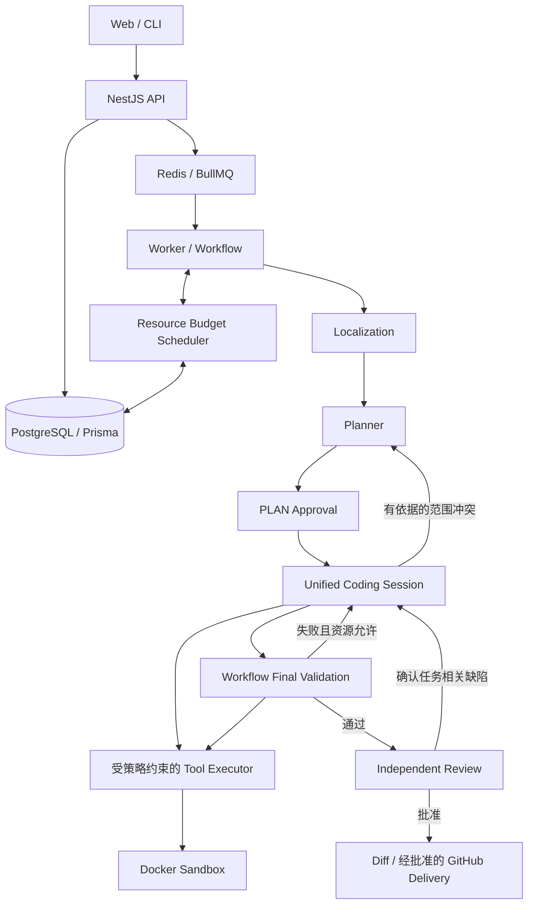
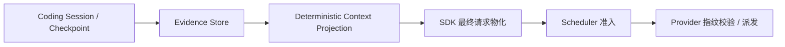

# DevFlow v2.3.1 技术报告

日期：2026-10-10。本文描述当前生产代码、公开配置及已有冻结实验；原始实验请求、候选、账单和私有评分材料不随仓库发布。

## 1. 版本定位与结论

v2.3.1 是 v2.3 的补丁版本，整合 Unified Coding Loop 后已验证的 Resource Budget Scheduler、Context Projection Optimizer、动态工具契约及有界参数纠错。此次整理统一包版本和文档，不改变 Agent 行为，也没有新增付费实验。

生产行为参考提交 `210f684` 及其实现提交；最近真实实验使用同一 Runtime 指纹 `74cc4045866dd21d2471930a4a639f31ac749a05bc93379ed526123a2b209532`。版本号、提交和 Runtime 指纹分别标识发布、代码快照与实验实现，不互相替代。

当前已证明限定任务中的完整修复能力：E02 两次独立运行均严格通过，最新四题批次 E08 严格通过。最新四题总成绩为 **1/4**，E05、E06、E10 仍失败。E10 未达到 v2.4 的升级条件；不能将重新规划准入、生成补丁或流程恢复称为修复成功。

## 2. 系统组成与业务流程

| 模块                           | 当前职责                                                |
| ------------------------------ | ------------------------------------------------------- |
| `apps/web`                     | Next.js 界面、任务与 Run 状态、事件及审批展示           |
| `apps/api`                     | NestJS REST/SSE、意图持久化、查询与队列派发             |
| `apps/worker`                  | 工作流编排、阶段绑定、诊断/证据交接、预算和恢复         |
| `apps/cli`                     | 命令行入口和任务操作                                    |
| `packages/agent`               | 模型端口、工具调用 Runtime、Coding Session 与上下文投影 |
| `packages/tools` / `sandbox`   | 工具契约、参数校验、权限及隔离执行                      |
| `packages/workflow` / `shared` | 工作流与共享领域契约                                    |
| `packages/database`            | Prisma 数据模型与持久化                                 |
| `packages/git` / `github`      | 基准/候选 Git 操作与经批准的交付                        |
| `packages/eval`                | 评测接口；独立评分与公开验证分别报告                    |

Task 固定不可变基准 commit 或本地快照。Run 保存事件、审批、当前源码身份、候选、指标与资源消费。队列携带版本化派发身份，Worker 使用 Lease 和并发版本校验处理恢复，避免旧消息重复执行。

## 3. Agent 边界与迭代闭环

**Localization** 只读检索和定位，提供候选、源码证据与关系图。TS/JS 支持版本化文件依赖、导入和导出关系；Python、Java、C++ 采用有界静态或词法导航，不代表完整多语言语义图。别名、转发、循环及歧义需保留来源；不完整图不能证明实现不存在，也不禁止图外补读。

**Planner** 输出简短修复提案：拟修改目标、方向、验证和未决问题。提案合法不等于行为正确。当前保留初始规划及既有有界只读补查，没有迁入此前完整的四轮 Planner 调查状态机。调查候选没有写权限；PLAN 审批才确定可写范围。

**Coding** 将原 Execute 与 Repair 合为一个持久化 Session。修改、公开测试、失败分析、继续修复和新审批恢复共享模型绑定、历史、工具、检查点与原任务预算。`TEST_REPAIR`、`REVIEW_REPAIR` 等旧标签仍可读，但不启动独立 Repair Agent。

有效 `finishPhase` 提交当前候选，宿主不追加确认调用；合法补丁本身不意味着任务已经完成。Workflow 强制执行最终公开验证。失败在资源允许时返回原 Session，保留诊断及未完成要求。需要扩大范围时，使用全流程最多一次重新规划及最多两次 Planner 请求，并获得新的 PLAN 审批；审批恢复不重置消费或期限。

**Review** 独立运行且没有直接仓库工具。宿主提供受控源码补证、关系信息及隔离的公开复现。判断区分 Issue 未解决、补丁回归、无关既有问题、建议和证据缺口。只有确认且属于当前任务的缺陷驱动修复；引用存在只证明来源，公开测试或独立评分通过也不能自动覆盖 Review。

详细契约见 [Coding Loop](unified-coding-loop-20261008.md)、[工作流](v2-workflow.md)和[证据导航](localization-evidence.md)。

## 4. Resource Budget Scheduler

Scheduler 位于 Worker 内，集中提供 `quote / reserve / admit / settle`。操作清单先估算必要执行路径，再进行准入，执行后按实际 usage 结算。持久化 Ledger 通过 compare-and-swap 更新，审批、重启和检查点恢复不能领取新的预算。

预算分为三层：Run 硬上限、基于当前请求及操作清单的动态容量分配、运行时消费账本。真实验收沿用每 Run **75 次逻辑工具、25 步、250,000 token、25 分钟**；这些上限可配置，但 Agent 无权提高。费用上限与价格由宿主配置和实验授权决定。

顺序执行成本累计；只有真正互斥的分支采用共享成本加最大分支成本。必要候选核实、检查点、恢复、修改、验证与 Review 均需报价，可选探索可以裁减，必要路径不足时在执行前阻断。

逻辑工具调用、内部执行、物理 IO 和缓存命中分别记账，不能相加当作同一种额度。预留是容量约束，不是重复消费；同身份缓存复用必须减少真实操作。Provider 返回的 token/cost usage 结算一次；缺失回执保留费用上界，不伪装成零消费。日志区分决策尝试、实际 HTTP、结算及 `requestIssued=false`。

当前机制仍有待核实的路径报价和继续修复预留问题，见第 8 节。架构集中化不意味着所有历史预算阻断已解决。实现及不变量见[资源调度架构](resource-budget-scheduler.md)。

## 5. Context Projection Optimizer

完整 Session 历史与模型请求视图分离，流程为：

- **P0**：Task、最新 Plan/Approval、当前 diff、失败诊断、未完成要求及可信控制状态。
- **P1**：当前 SHA 的源码、定义、关系和历史反证，按相关性选择。
- **P2**：重复记录、成功的过期源码输出及失效提示，使用可恢复引用和完整交互级去重。

Coding 投影是确定性的，**不调用 LLM 压缩**。原值保存在 Evidence Store；引用关联记录、位置及 SHA，能够核实恢复。其他阶段已有可选摘要配置不等于 Coding 投影使用 LLM 摘要。

源码按完整行/记录保留，不以机械截断必要实现制造容量通过。模型未收到的范围不能当作已知；必要反证或完整记录无法容纳时明确报告缺口。

`prepareRequest` 在零网络物化步骤构造包含 Tool Schema 的最终 SDK HTTP body；Scheduler 与 Provider 使用同一投影和指纹。旧 adapter envelope 与最终 body 都受原容量约束，派发后不能另行裁剪。宿主 token 估算采用 UTF-8 bytes/3 向上取整，不是供应商真实 tokenizer；实际使用以 usage 为准。

E02 冻结请求免费回放从 **98,090 bytes 降至 75,114 bytes（约 23.4%）**，通过原 96,000 bytes 输入视图限制。该结果证明请求构造可达，不单独证明模型能够修复任务。详见[上下文投影](context-projection-optimizer.md)。

## 6. 动态工具契约与有界纠错

模型看到的 Tool Schema 应反映当前 Runtime 有效参数限制。参数错误、探索耗尽和权限拒绝分别处理；合法但超出当前探索能力的调用不能被混同为写入越权。

`VALIDATION_ERROR` 提供字段路径、期望类型、实际类型、有效 Schema 和正确结构示例。宿主不自动把字符串改成数组，也不删除错误字段来接受请求。

可恢复参数错误复用 `executionRecovery`，与编辑格式错误及 LENGTH 恢复共享一次纠正额度。无效调用不算进展；待纠正时可以暂缓原停滞边界，计数不清零。合法但重复、没有新证据的查询仍停机，越权或过期 SHA 不能获得新纠正额度。

额度在派发前预占并持久化。若纠正结果提交前中断，恢复明确阻断，不能重复派发或重新开放工具。当前源码、新审批和原 Run 资源约束始终生效。详见[Tool Call Recovery](tool-call-recovery.md)。

## 7. 模型、验证与安全

下表为公开 `.env.example` 的活跃阶段配置，不是供应商能力保证；用户可以按阶段替换平台与模型。

| 阶段              | 示例模型                                | 思考/强度   | 输出上限 | 上下文 |
| ----------------- | --------------------------------------- | ----------- | -------: | -----: |
| Localization      | 继承 `LLM_MODEL`：`deepseek-v4.1-flash` | 关闭 / none |    4,096 | 32,000 |
| Planner           | `deepseek-v4-pro-0813`                  | 开启 / high |    8,192 | 32,000 |
| Coding（EXECUTE） | `glm-5.3`                               | 开启 / low  |    8,192 | 32,000 |
| Review            | `deepseek-v4-pro-0813`                  | 开启 / high |   16,384 | 64,000 |

示例统一百炼兼容接口。旧 `LLM_REPAIR_*` 保留配置读取兼容，统一 Coding 使用 `LLM_EXECUTE_*`。配置输出包含推理和最终回答，预检不能暗中压低上限。Review 截断语义恢复使用同模型 low；正常审查保持 high。接入详情见[阶段模型配置](stage-models.md)。

公开验证按 **build → typecheck → lint → test** 执行，首个失败后停止；未执行和未配置分别为 `NOT_RUN`、`NOT_CONFIGURED`。npm 项目发现现有脚本，其他项目由宿主提供来源可核查的公开 profile。一次 profile 共享既有最高 300 秒期限，并检查任务资源。TS/JS、Python、Java、C++ 诊断用于导航；读取正确路径不授予写权限。

不可信代码运行在受限 Docker Sandbox；路径和符号链接校验、完整 SHA、批准范围和测试保护约束编辑。凭据留在平台边界，不注入不可信源码执行环境。GitHub 交付需经批准并保留幂等身份；Review 复现与私有评分隔离，答案不进入模型上下文。

开发依赖 Node.js ≥22.12、npm ≥10、Docker、PostgreSQL 和 Redis。部署仍需按目标环境补齐鉴权及运维控制，不能把本地开发服务直接视为生产安全部署。

## 8. 真实实验与未解决问题

以下是现有冻结实现的观察。本次补丁版本没有重新运行付费案例，也不合并不同批次成绩。

| 案例/批次           | 公开验证                                              | 独立 Issue / 原测试 / 完整性 | Review | 严格结果 |
| ------------------- | ----------------------------------------------------- | ---------------------------- | ------ | -------- |
| E02 首次定向复测    | PASS，133/133                                         | PASS / PASS / PASS           | PASS   | PASS     |
| E02 同 Runtime 再测 | PASS，133/133                                         | PASS / PASS / PASS           | PASS   | PASS     |
| E05 最新四题        | build/typecheck PASS，test 299 PASS/1 FAIL            | PASS / FAIL / PASS           | 未进入 | FAIL     |
| E06 最新四题        | 未形成写入范围，Workflow Test 未运行                  | FAIL / FAIL / PASS，无补丁   | 未进入 | FAIL     |
| E08 最新四题        | 四项 PASS，test 1,523/1,523                           | PASS / PASS / PASS           | PASS   | PASS     |
| E10 最新四题        | build/typecheck/lint PASS；最终 test 257 PASS/22 FAIL | FAIL / FAIL / PASS           | 未进入 | FAIL     |

E02 两次运行是同 Runtime 的单题重复观察 **2/2**；最新四题独立成绩 **1/4（25%）**。这些小样本不足以估算任意 GitHub Issue 的成功率。

| 最新四题         | HTTP / 已结算 | 已确认 token | 逻辑工具 | 已确认费用 | 未确认费用上界 |
| ---------------- | ------------: | -----------: | -------: | ---------: | -------------: |
| E05              |       12 / 11 |      112,575 |       28 |  ¥0.982134 |      ¥0.768104 |
| E06              |         6 / 6 |       66,869 |       12 |  ¥0.657183 |             ¥0 |
| E08              |         9 / 9 |       76,612 |       16 |  ¥0.710809 |             ¥0 |
| E10              |       13 / 13 |      165,010 |       75 |  ¥1.445859 |             ¥0 |
| 合计（四个 Run） |       40 / 39 |      421,066 |      131 |  ¥3.795985 |      ¥0.768104 |

费用按实验冻结价格规则保守核算，不是供应商最终账单。未知请求实际 token 不计入已确认 token；131 是跨四 Run 合计，不与单 Run 75 上限混用。

主要未解决问题：

1. **E05**：环境变体缓存隔离仍错；一次模型超时后保留未知请求上界，后续请求预检 token 缺口 26,359。不能直接认定全部预留冗余，也不能以 Issue PASS 覆盖原测试失败。
2. **E06**：未联合获得 close/reopen、compaction 落盘和持久化消费者等决定性证据。Planner 明确返回 `INSUFFICIENT_EVIDENCE`，不是格式失败；尚不足以断言证据充分但模型判断错误。
3. **E10**：Replan、新审批及原 Session 恢复已真实发生，失败数从 32 降至 22，但持久化、状态区分和多个视图一致性仍错。下一项必要 Repair 操作拟达 76 次，被 75 次工具硬限阻断；没有第 76 次实际消费。Review 未运行，不能归因为 Review 误拒。

应继续审计复杂行为消费者覆盖、必要宿主 IO/恢复成本及下一轮修复路径预留。不会通过提高硬限、放宽审批或评分规则解决这些问题。

原始依据见[E02 定向验收](tool-call-recovery-e02-live-20261009.md)、[E02 同 Runtime 再测](e02-repeat-20261009.md)和[最新四题完整记录](four-case-validation-20261009.md)。历史九题和早期 E07 成绩保留在各自报告，不作为当前批次成功率。

## 9. 发布检查与材料边界

v2.3.1 统一根包、13 个 workspace 的版本、内部依赖及 lockfile；外部依赖和冻结实验版本不改变。

| 本次发布检查                          | 结果                                             |
| ------------------------------------- | ------------------------------------------------ |
| 完整测试，`vitest run --maxWorkers=1` | 997 PASS、31 SKIP；123 个测试文件通过、12 个跳过 |
| lint / typecheck                      | PASS                                             |
| TypeScript 与 Web 生产构建            | PASS                                             |
| Prisma schema 校验                    | PASS                                             |
| 全仓格式检查 / Git diff 空白检查      | PASS                                             |
| 公开候选文件与版本一致性检查          | PASS，458 个候选文件，无发现                     |
| 外部依赖 lock 条目 / 报告链接校验     | 未变；10 个文档链接有效                          |

首轮测试与构建等检查并行执行时，两项定位/关系图测试超过原 5 秒期限，另 995 项通过；随后完整串行重跑在原断言和期限下全部通过，未修改测试或生产行为。首次 Web 构建因受限环境路径访问失败，正常权限下重试成功。以上仅为工程验收，不替代新版本真实任务验收。

本次不重复付费实验或宣称新增 Docker 行为验收。已完成的工具恢复原请求 Docker 回放和相关工程验证见各实现验收文档。受控模型只证明编排、权限和预算链路，不代表真实模型具有相同定位能力。

`.env`、数据集、私有评分器、原始账本、候选和实验请求保持 Git 排除；个人简历文件同样排除。公开仓库保留架构、契约和去敏验收结论，完整历史材料留在本地。GitHub 推送发布代码与文档，不等于 npm 发布或线上部署。
