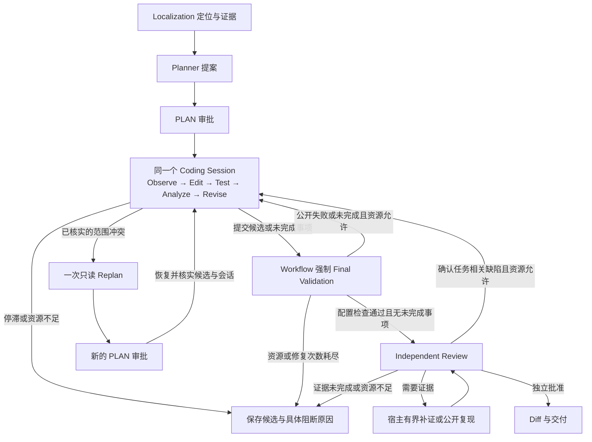

# Unified Coding Loop 架构与验收记录

本轮将 Execute 与 Repair 合并为一个持久化 Coding Session，目标是修复两处 P0 阻断：E07 保存未完成候选并获得公开诊断后跳过修复；E10 发现范围冲突后，重新规划所需资源未能及时保留。架构变更用于打通编辑、测试、修订与重新审批的闭环。流程恢复、生成补丁和真实修复成功分别验收。

包版本暂为 `2.2.0`。只有本轮冻结版本严格修复 E07 或 E10 至少一题，才升级为 v2.3；历史通过结果不能满足这一条件。

开始时工作区无未提交的公开源码变更。原版本 `5a3e816` 已保存在 `codex/pre-unified-coding-loop-20261008`，开发分支为 `codex/unified-coding-loop`。没有重置原分支，也没有将本地凭据、私有数据集和账本提交至 Git。

## 流程与职责

| 组件               | 职责与边界                                                                            |
| ------------------ | ------------------------------------------------------------------------------------- |
| Localization       | 只读定位、静态关系和源码证据；候选不授予写权限。                                      |
| Planner 与审批     | 提议修改方向和范围；新增写入目标需要新的 PLAN 审批。                                  |
| Coding Session     | 保留同一运行时、历史、预算消费、纠正额度和检查点；读取、编辑、接收公开失败并修订。    |
| Final Validation   | 由 Workflow 执行公开 build、typecheck、lint、test profile；模型不能跳过或声明其通过。 |
| Independent Review | 使用独立模型和证据输入裁决；缺证由宿主补证，确认缺陷才能成为修复指令。                |
| 独立评分           | 在模型上下文之外检查 Issue、原测试和完整性；评分材料不进入 Coding 或 Review。         |

`finishPhase` 是向 Workflow 交接候选的事件。有效提交后立即进入宿主验证；新的失败诊断、独立 Review 结论或新审批，才能使同一会话继续。无变化的重复反馈不能无限重新开放编辑。`TEST_REPAIR`、`REVIEW_REPAIR` 与历史 `REPAIR` 指标继续可读，它们表示失败处理原因，不再表示另一个 Agent 生命周期。

## 模型与上下文

全程 Coding 使用 `LLM_EXECUTE_*`：示例为百炼 `glm-5.3`，开启思考，`low`，8,192 输出 token、32,000 上下文 token。测试失败、Review 修复和审批恢复都沿用这一绑定。`LLM_REPAIR_*` 保留配置读取兼容，不改变统一会话的模型或输出上限。Independent Review 继续使用自己的 `LLM_REVIEW_*` 绑定。

完整历史保存在会话检查点中，请求只携带当前阶段可用的视图。原始任务、最新批准范围、稳定诊断、未完成事项与源码记录分开管理；旧源码和旧审批不能冒充当前证据或权限。宿主反馈关联当前任务状态，修改后必须验证源码身份。预算估计需与实际投影和配置输出对应，不能通过压低模型输出上限使请求勉强获准。

同一会话的进展、候选指纹、一次纠正额度、调用和费用占用在失败迭代后保留。明确完成不要求追加一轮确认；连续无进展或重复候选仍按原有边界停止。

## 预算与恢复

保持原有 75 次工具、25 步、250,000 token、25 分钟及修复次数上限。验证失败不会产生一份新的 Repair 预算。继续编码与重新规划使用互斥分支预留，公共验证和独立 Review 的共同成本只保留一次；预留不计为消费，实际请求和物理工具操作计量一次。

重新规划预留包含当前可构造的 Planner 输入、配置输出、与 Planner 派发一致的格式恢复估计，以及审批后继续 Coding 的必要请求。新证据、实际输入或剩余资源变化后再次预检；最低调查分支不承诺覆盖任意数量的新目标。预算不足时保存具体缺口和 `requestIssued=false`。

审批等待前保存候选及会话关联，恢复时核实基准、累计修改、新建/删除文件、当前 SHA 和新审批。来源或检查点无法确认时停止，不在重新克隆的仓库上重启旧会话。期限、已消费资源、重新规划次数和纠正额度不会因恢复而重置。

## 分阶段验收

| 批次             | 改动                                                                                  | 当前证据                                                                                                |
| ---------------- | ------------------------------------------------------------------------------------- | ------------------------------------------------------------------------------------------------------- |
| 第一批 `ba823de` | 持久化 Coding Session；宿主反馈继续同一会话；实际派发计数；保留纠正、进展和任务状态。 | 158 项 Agent 相关免费测试通过。证明运行时编排，不代表真实模型已经修复 E07/E10。                         |
| 第二批 `93ba997` | Worker 统一执行与失败反馈、最终验证、范围重新审批、预算交接及候选恢复。               | 全工程 830 项测试通过，29 项按环境跳过；统一会话 Worker 专项 7/7。实际 Docker 受控流程 E07/E10 均通过。 |
| F1 冻结验收      | E07、E10 真实任务及 E02/E08 回归。                                                    | 严格 1/4，独立补丁验收 3/4；E07/E10 严格 0/2，不满足升级条件。                                          |

免费验收必须同时覆盖及时结束和继续修订：E07 的修改→公开编译失败→同一会话修复→重测；E10 的范围冲突→真实 Planner 派发→新审批→保留候选恢复；以及过期 SHA、越权、重复反馈、无进展、恢复后消费不重置、预算不足不派发和公开失败不能被收尾掩盖。受控模型只证明宿主链路正确。

已完成的免费 Docker 验收中，E07 经历 TS2304 编译失败后，在同一 Session 修复、重测并通过 Review，使用 30 次工具、5 次模型调用；E10 实际派发受控 Planner、生成新审批，再由新 Worker 核实检查点并恢复原候选与 Session，继续修复、重测和 Review，使用 62 次工具、6 次模型调用。以上模型调用均由本地受控模型提供，新增 API 费用为零。

E02/E08 使用历史 Devflow 候选作免费公开验证回归，分别通过 133/1523 个公开测试；E08 的 build、typecheck、lint、test 全部通过。它们证明兼容路径仍能运行，不能计入本轮真实成功率。

本轮免费验收还发现并修正了三个交接问题：Plan 经 Schema 规范化后键顺序不同造成误判；完整诊断在历史和稳定任务上下文重复投影造成超限；宿主提供失败反馈后，原写后限制阻断批准范围外的只读诊断。对应修复采用规范化身份、保留原始历史的无损去重和只读诊断模式，均不放宽写权限。未知中断或旧任务无法证明会话消费与候选关联时明确阻断，不能领取新预算。

最终审计另补齐新审批恢复后的工具预留：已消费的准备/恢复成本释放，候选保存、当前身份复核、公开检查和 Review 仍保留。22 项相关测试通过；E10 Docker 再验仍以 62 次工具完成。E/F Docker 八项全部通过：其中预算停止用例更新为实际准备后的 `PLAN_FINAL_PREFLIGHT_BLOCKED`，仍断言 Planner 未派发和 `requestIssued=false`，没有放宽预算。格式、类型、lint 与公开文件扫描通过；私有验收原件保持 Git 忽略。

## F1 冻结真实结果：93ba997

冻结代码、模型、公开验证 profile、原始输入和独立评分器后逐题报告。严格成功须同时满足工作流完成、公共检查通过、独立 Issue/原测试/完整性通过，以及最终 Review 批准。未运行、流程恢复和严格修复成功分别记录。

运行时身份为 `cae99ccb2a93fcb8444e817ad5d7954252568a6ed76421cd5c91ef893ea3fc68`。四题从 Localization 开始，各一次完整流程，未注入历史 Plan 或补丁。最终冻结与账本审计 PASS，43/43 个 HTTP 请求全部结算，无新增未确认费用。

| 案例 | 同会话修订与公开验证                                               | 独立 Issue / 原测试 / 完整性 | Review              | 严格结果 | HTTP（定位/规划/Coding/Review） |   token | 工具 |      费用 |
| ---- | ------------------------------------------------------------------ | ---------------------------- | ------------------- | -------- | ------------------------------- | ------: | ---: | --------: |
| E07  | 首轮 build TS6133；同会话修正三处 import；之后预算阻断，宿主未重测 | PASS / PASS / PASS           | 未运行              | FAIL     | 10（3/1/6/0）                   | 124,362 |   37 | ¥0.972089 |
| E10  | 两轮无有效新证据后停止；无补丁、未运行 Test、未触发 Replan         | FAIL / FAIL / PASS           | 未运行              | FAIL     | 9（3/1/5/0）                    |  83,999 |   12 | ¥0.672996 |
| E02  | 首轮测试发现重复完成事件；同会话修订，重测 133 项通过              | PASS / PASS / PASS           | PASS                | PASS     | 12（3/2/6/1）                   | 148,999 |   35 | ¥1.402399 |
| E08  | 首轮 build/typecheck/lint/test 通过，1,523 项公开测试通过          | PASS / PASS / PASS           | 三轮 NEEDS_EVIDENCE | FAIL     | 12（3/1/5/3）                   | 126,759 |   18 | ¥1.457183 |

合计严格成功 **1/4**、独立补丁验收 **3/4**，484,119 token，新增 **¥4.504667**。累计保守占用 **¥131.397338 / ¥150**，余额 **¥18.602662**；此前未确认占用 ¥1.963125 已包含在累计中，不能再次相加。E02 的两次 Planner 包含一次 LENGTH 恢复。E07 有 11 次决策尝试、10 次实际 HTTP，最后一次在宿主预检停止。

所有 Coding HTTP 均为 `glm-5.3`、思考开启、low、`max_tokens=8192`；不存在独立 Repair HTTP。E07/E02 在同一 sessionId 中收到 PUBLIC_VALIDATION 并继续修改，原任务、诊断、历史和累计消费保留。Review 独立使用 high、16,384 输出上限且无工具。工作流耗时（不含独立评分）依次为 236.494、250.410、293.228、825.119 秒；独立评分耗时为 38.522、25.469、6.595、192.713 秒。

### 失败归因与下一批边界

**E07：本轮新增的预算分支调度缺陷。** 已有合法修正候选且进入 `submissionOnly` 后，仍保留未选择的 Replan 分支 52,054 token。最后一次提交请求 32,838，加 Review 正常与恢复 43,574，再加 Replan 52,054，合计 128,466，大于剩余 125,638，差 2,828。纠正预留 33,381 参与关闭探索，但没有在最终 required 中重复扣除。正常提交分支只需 76,412，存在可执行空间。最终补丁独立 build/typecheck/lint 与行为验收已通过，不能将旧首轮编译错误误报为最终候选仍有编译缺陷；缺少原生重测和 Review 仍必须严格失败。

**E10：原有目录导航缺陷与错误路径猜测。** `queryRelations` 接受 `src/execution`，导航却将真实目录当缺失文件，转向全仓兜底，四次读取落在配置和 API 文件；这些文件不含所请求符号。图视图仍以目录作精确文件匹配，返回空结果，导航 observations 也未交接。随后模型读取不存在的 `run-state.ts`，按两轮无进展规则停止。新增 28 条 import 边不等于展示了 28 条任务相关关系。停机计数本身成立，但此前目录解析/反馈错误应修复。实际请求缺少关键持久化和事件转换依据，不能归因为证据充分时模型仍判断错误，也不能宣称本题真实 Replan 已恢复。

**E08：Review 的必要证据仍未取得。** Issue 明确要求历史记录保留调用者拼写并关联同一插件；补证先取得 CLI 传递原名的代码，但未取得执行服务和历史持久化实现，另有不存在路径请求。三轮 Review 均承认 canonical lookup 修复和公开验证通过，保持 EVIDENCE_GAP，没有确认代码缺陷或要求 Repair 修改。独立评分 PASS 不能替代这次独立 Review。保留此问题，不在下一批修改 Review 裁决。

下一批仅修正提交时的资源分支选择与目录查询语义/反馈，保持硬预算、审批、无进展停机规则和独立评分。新代码须再次免费验收、独立冻结并复测 E07/E10；F1 结果永久保留，不与后续成功混成一个通过率。

真实报告还应列出总模型请求、token、费用、公开验证、独立评分、Review 和具体失败原因。累计费用上限仍为 ¥150，启动前核对账本并保留逐请求预检；预算不足的案例不发出新增请求。原始请求、账单、候选及私有评分材料继续排除在 Git 外。

相关记录：[模型配置](stage-models.md)、[工作流](v2-workflow.md)、[此前 Execute 收尾验收](execute-completion-20261008.md)、[v2.2 后两条分支事件复盘](v22-development-history-20261008.md)。
