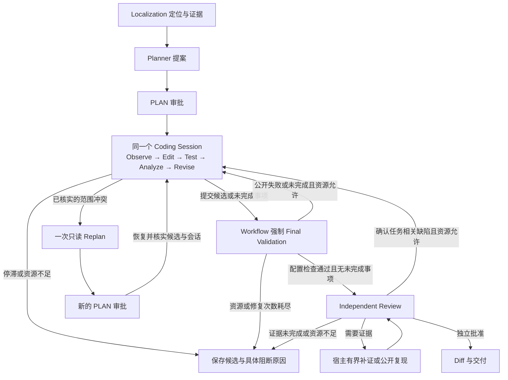

# Unified Coding Loop 架构与验收记录

本轮将 Execute 与 Repair 合并为一个持久化 Coding Session，目标是修复两处 P0 阻断：E07 保存未完成候选并获得公开诊断后跳过修复；E10 发现范围冲突后，重新规划所需资源未能及时保留。架构变更用于打通编辑、测试、修订与重新审批的闭环。流程恢复、生成补丁和真实修复成功分别验收。

包版本升级为 **`2.3.0`**：冻结实现 `73ec92f` 的 E07 已通过公开验证、独立 Issue/原测试/完整性验收和最终 Review，满足用户设定的“E07 或 E10 至少一题严格通过”条件。最终有效结果为 **E07、E02 严格通过；E10、E08 严格失败**。目标批次严格 **1/2**，配置纠正后的回归批次严格 **1/2**，不能宣称本轮全部 P0 已关闭或整体成功率已提高。首次 F3 回归控制器漏配公开验证 profile，其原始结果保留，但不计入有效回归通过率。

F1/F2、F3 目标及首次回归实验期间包版本为 `2.2.0`；纠正回归在仅更新版本元数据和文档的 `109b679` 上以 `2.3.0` 运行，生产实现保持 `73ec92f`。各批运行代码、模型、输入、公开 profile 和评分器分别冻结；此前结果保留，不与后续结果混合。当前更改仅在本地提交，未推送、打发布标签或创建 GitHub Release。

开始时工作区无未提交的公开源码变更。原版本 `5a3e816` 已保存在 `codex/pre-unified-coding-loop-20261008`，开发分支为 `codex/unified-coding-loop`。没有重置原分支，也没有将本地凭据、私有数据集和账本提交至 Git。

## 流程与职责

| 组件               | 职责与边界                                                                            |
| ------------------ | ------------------------------------------------------------------------------------- |
| Localization       | 只读定位、静态关系和源码证据；候选不授予写权限。                                      |
| Planner 与审批     | 提议修改方向和范围；新增写入目标需要新的 PLAN 审批。                                  |
| Coding Session     | 保留同一运行时、历史、预算消费、纠正额度和检查点；读取、编辑、接收公开失败并修订。    |
| Final Validation   | 由 Workflow 执行公开 build、typecheck、lint、test profile；模型不能跳过或声明其通过。 |
| Independent Review | 使用独立模型和证据输入裁决；缺证由宿主补证，确认缺陷才能成为修复指令。                |
| 独立评分           | 在模型上下文之外检查 Issue、原测试和完整性；评分材料不进入 Coding 或 Review。         |

`finishPhase` 是向 Workflow 交接候选的事件。有效提交后立即进入宿主验证；新的失败诊断、独立 Review 结论或新审批，才能使同一会话继续。无变化的重复反馈不能无限重新开放编辑。`TEST_REPAIR`、`REVIEW_REPAIR` 与历史 `REPAIR` 指标继续可读，它们表示失败处理原因，不再表示另一个 Agent 生命周期。

## 模型与上下文

全程 Coding 使用 `LLM_EXECUTE_*`：示例为百炼 `glm-5.3`，开启思考，`low`，8,192 输出 token、32,000 上下文 token。测试失败、Review 修复和审批恢复都沿用这一绑定。`LLM_REPAIR_*` 保留配置读取兼容，不改变统一会话的模型或输出上限。Independent Review 继续使用自己的 `LLM_REVIEW_*` 绑定。

完整历史保存在会话检查点中，请求只携带当前阶段可用的视图。原始任务、最新批准范围、稳定诊断、未完成事项与源码记录分开管理；旧源码和旧审批不能冒充当前证据或权限。宿主反馈关联当前任务状态，修改后必须验证源码身份。预算估计需与实际投影和配置输出对应，不能通过压低模型输出上限使请求勉强获准。

同一会话的进展、候选指纹、一次纠正额度、调用和费用占用在失败迭代后保留。明确完成不要求追加一轮确认；连续无进展或重复候选仍按原有边界停止。

## 预算与恢复

保持原有 75 次工具、25 步、250,000 token、25 分钟及修复次数上限。验证失败不会产生一份新的 Repair 预算。继续编码与重新规划使用互斥分支预留，公共验证和独立 Review 的共同成本只保留一次；预留不计为消费，实际请求和物理工具操作计量一次。

**工具口径限制：75 次硬门槛实际检查 `metrics.toolCalls`，不是 `toolExecutions`。** 本文未另作标注的“工具”列使用前者；后者另外记录批量检索、源码读取及部分 Review 内部执行，且不是所有底层系统 IO 的精确总数。初始整包检索可能只占一次 call，内部多次读取计入 executions；部分宿主读取只增加 executions。此口径在 v2.2 已存在，本轮未提高上限或绕过现有检查，但不能宣称所有实际 IO 均受 75 次统一限制。最终结果另列两种统计；后续统一预算必须先统一操作单位，不能直接更换数字而忽略真实成本。

重新规划预留包含当前可构造的 Planner 输入、配置输出、与 Planner 派发一致的格式恢复估计，以及审批后继续 Coding 的必要请求。新证据、实际输入或剩余资源变化后再次预检；最低调查分支不承诺覆盖任意数量的新目标。预算不足时保存具体缺口和 `requestIssued=false`。

审批等待前保存候选及会话关联，恢复时核实基准、累计修改、新建/删除文件、当前 SHA 和新审批。来源或检查点无法确认时停止，不在重新克隆的仓库上重启旧会话。期限、已消费资源、重新规划次数和纠正额度不会因恢复而重置。

## 分阶段验收

| 批次             | 改动                                                                                  | 当前证据                                                                                                |
| ---------------- | ------------------------------------------------------------------------------------- | ------------------------------------------------------------------------------------------------------- |
| 第一批 `ba823de` | 持久化 Coding Session；宿主反馈继续同一会话；实际派发计数；保留纠正、进展和任务状态。 | 158 项 Agent 相关免费测试通过。证明运行时编排，不代表真实模型已经修复 E07/E10。                         |
| 第二批 `93ba997` | Worker 统一执行与失败反馈、最终验证、范围重新审批、预算交接及候选恢复。               | 全工程 830 项测试通过，29 项按环境跳过；统一会话 Worker 专项 7/7。实际 Docker 受控流程 E07/E10 均通过。 |
| F1 冻结验收      | E07、E10 真实任务及 E02/E08 回归。                                                    | 严格 1/4，独立补丁验收 3/4；E07/E10 严格 0/2，不满足升级条件。                                          |

免费验收必须同时覆盖及时结束和继续修订：E07 的修改→公开编译失败→同一会话修复→重测；E10 的范围冲突→真实 Planner 派发→新审批→保留候选恢复；以及过期 SHA、越权、重复反馈、无进展、恢复后消费不重置、预算不足不派发和公开失败不能被收尾掩盖。受控模型只证明宿主链路正确。

已完成的免费 Docker 验收中，E07 经历 TS2304 编译失败后，在同一 Session 修复、重测并通过 Review，使用 30 次工具、5 次模型调用；E10 实际派发受控 Planner、生成新审批，再由新 Worker 核实检查点并恢复原候选与 Session，继续修复、重测和 Review，使用 62 次工具、6 次模型调用。以上模型调用均由本地受控模型提供，新增 API 费用为零。

E02/E08 使用历史 Devflow 候选作免费公开验证回归，分别通过 133/1523 个公开测试；E08 的 build、typecheck、lint、test 全部通过。它们证明兼容路径仍能运行，不能计入本轮真实成功率。

本轮免费验收还发现并修正了三个交接问题：Plan 经 Schema 规范化后键顺序不同造成误判；完整诊断在历史和稳定任务上下文重复投影造成超限；宿主提供失败反馈后，原写后限制阻断批准范围外的只读诊断。对应修复采用规范化身份、保留原始历史的无损去重和只读诊断模式，均不放宽写权限。未知中断或旧任务无法证明会话消费与候选关联时明确阻断，不能领取新预算。

最终审计另补齐新审批恢复后的工具预留：已消费的准备/恢复成本释放，候选保存、当前身份复核、公开检查和 Review 仍保留。22 项相关测试通过；E10 Docker 再验仍以 62 次工具完成。E/F Docker 八项全部通过：其中预算停止用例更新为实际准备后的 `PLAN_FINAL_PREFLIGHT_BLOCKED`，仍断言 Planner 未派发和 `requestIssued=false`，没有放宽预算。格式、类型、lint 与公开文件扫描通过；私有验收原件保持 Git 忽略。

## F1 冻结真实结果：93ba997

冻结代码、模型、公开验证 profile、原始输入和独立评分器后逐题报告。严格成功须同时满足工作流完成、公共检查通过、独立 Issue/原测试/完整性通过，以及最终 Review 批准。未运行、流程恢复和严格修复成功分别记录。

运行时身份为 `cae99ccb2a93fcb8444e817ad5d7954252568a6ed76421cd5c91ef893ea3fc68`。四题从 Localization 开始，各一次完整流程，未注入历史 Plan 或补丁。最终冻结与账本审计 PASS，43/43 个 HTTP 请求全部结算，无新增未确认费用。

| 案例 | 同会话修订与公开验证                                               | 独立 Issue / 原测试 / 完整性 | Review              | 严格结果 | HTTP（定位/规划/Coding/Review） |   token | 工具 |      费用 |
| ---- | ------------------------------------------------------------------ | ---------------------------- | ------------------- | -------- | ------------------------------- | ------: | ---: | --------: |
| E07  | 首轮 build TS6133；同会话修正三处 import；之后预算阻断，宿主未重测 | PASS / PASS / PASS           | 未运行              | FAIL     | 10（3/1/6/0）                   | 124,362 |   37 | ¥0.972089 |
| E10  | 两轮无有效新证据后停止；无补丁、未运行 Test、未触发 Replan         | FAIL / FAIL / PASS           | 未运行              | FAIL     | 9（3/1/5/0）                    |  83,999 |   12 | ¥0.672996 |
| E02  | 首轮测试发现重复完成事件；同会话修订，重测 133 项通过              | PASS / PASS / PASS           | PASS                | PASS     | 12（3/2/6/1）                   | 148,999 |   35 | ¥1.402399 |
| E08  | 首轮 build/typecheck/lint/test 通过，1,523 项公开测试通过          | PASS / PASS / PASS           | 三轮 NEEDS_EVIDENCE | FAIL     | 12（3/1/5/3）                   | 126,759 |   18 | ¥1.457183 |

合计严格成功 **1/4**、独立补丁验收 **3/4**，484,119 token，新增 **¥4.504667**。累计保守占用 **¥131.397338 / ¥150**，余额 **¥18.602662**；此前未确认占用 ¥1.963125 已包含在累计中，不能再次相加。E02 的两次 Planner 包含一次 LENGTH 恢复。E07 有 11 次决策尝试、10 次实际 HTTP，最后一次在宿主预检停止。

所有 Coding HTTP 均为 `glm-5.3`、思考开启、low、`max_tokens=8192`；不存在独立 Repair HTTP。E07/E02 在同一 sessionId 中收到 PUBLIC_VALIDATION 并继续修改，原任务、诊断、历史和累计消费保留。Review 独立使用 high、16,384 输出上限且无工具。工作流耗时（不含独立评分）依次为 236.494、250.410、293.228、825.119 秒；独立评分耗时为 38.522、25.469、6.595、192.713 秒。

### 失败归因与下一批边界

**E07：本轮新增的预算分支调度缺陷。** 已有合法修正候选且进入 `submissionOnly` 后，仍保留未选择的 Replan 分支 52,054 token。最后一次提交请求 32,838，加 Review 正常与恢复 43,574，再加 Replan 52,054，合计 128,466，大于剩余 125,638，差 2,828。纠正预留 33,381 参与关闭探索，但没有在最终 required 中重复扣除。正常提交分支只需 76,412，存在可执行空间。最终补丁独立 build/typecheck/lint 与行为验收已通过，不能将旧首轮编译错误误报为最终候选仍有编译缺陷；缺少原生重测和 Review 仍必须严格失败。

**E10：原有目录导航缺陷与错误路径猜测。** `queryRelations` 接受 `src/execution`，导航却将真实目录当缺失文件，转向全仓兜底，四次读取落在配置和 API 文件；这些文件不含所请求符号。图视图仍以目录作精确文件匹配，返回空结果，导航 observations 也未交接。随后模型读取不存在的 `run-state.ts`，按两轮无进展规则停止。新增 28 条 import 边不等于展示了 28 条任务相关关系。停机计数本身成立，但此前目录解析/反馈错误应修复。实际请求缺少关键持久化和事件转换依据，不能归因为证据充分时模型仍判断错误，也不能宣称本题真实 Replan 已恢复。

**E08：Review 的必要证据仍未取得。** Issue 明确要求历史记录保留调用者拼写并关联同一插件；补证先取得 CLI 传递原名的代码，但未取得执行服务和历史持久化实现，另有不存在路径请求。三轮 Review 均承认 canonical lookup 修复和公开验证通过，保持 EVIDENCE_GAP，没有确认代码缺陷或要求 Repair 修改。独立评分 PASS 不能替代这次独立 Review。保留此问题，不在下一批修改 Review 裁决。

### F2：按下一步操作预留资源，并纠正目录查询

本批仅修正提交时的资源分支选择与目录查询语义/反馈，保持硬预算、审批、无进展停机规则和独立评分。F1 结果永久保留，不与后续结果混成一个通过率。

- 正常编码继续保留可达的重新规划分支；进入 `SUBMIT_CURRENT` 后，只预留提交、当前候选核实、强制公开验证和独立 Review。此时释放尚未选择的 Replan 容量，预留释放不是返还已消费资源。模型若报告范围冲突，仍须另行通过实际准备预检和新的 PLAN 审批。
- 收尾模式、消费和纠正状态在请求前持久化。恢复时，宿主生成的单次只读 `gitDiff` 可以完成候选核实；该例外不适用于模型请求或写操作。验证与 Review 的真实成本继续保留。
- `queryRelations` 从已有仓库清单识别目录，在目录内优先选择已观察到的符号定义及消费者；已核实的导入/转发关系仍可指向目录外。缺失、清单不完整和符号歧义明确返回，不能把目录当缺失文件后静默搜索无关配置。
- 返回实际读取和展示路径、候选覆盖情况及导航观察。一次查询仍最多四次源码读取、512 KiB 原文，失败读取也占额度；输出在 8 KiB 总量中保留完整记录。目录解析本身不新增遍历或物理源码读取，也不证明根因已经找到。

最终全量工程测试 **849 项通过、29 项按环境跳过**；lint、typecheck、格式和公开文件检查通过。原始 E10 查询免费回放取得三个实现片段，实际读取四次、12,292 字节，输出 7,813 字节，同时说明未覆盖候选；这只证明查询正确执行，不代表真实模型完成了行为定位。

E07 的实际配置 Docker 回放通过：公开编译失败后，同一会话修正 import，提交、重测及独立受控 Review 完成。测试保留 Planner/Coding/Review 的 8,192/8,192/16,384 输出额度及原任务硬预算。在剩余 125,638 token 时，当前夹具按实际上下文算出所需 89,725，保留必要下游 54,961，并释放未选择分支 43,387；夹具输入与 F1 原始请求不同，F1 的原始数字另由预算单元回放核对，不混称相同请求。

E10 的实际 Worker/Docker 回放也通过：目录查询取得当前实现后，公开测试失败触发一次只读 Planner 请求、新 PLAN 审批；新 Worker 在第二个沙箱恢复原有候选和同一个 Session，再编辑新批准范围，公开测试从 FAIL 变为 PASS，最后由独立受控 Review 批准。合计 7 次 Coding、1 次 Planner、1 次 Review，9 步、65 次工具，66 个持久化检查点中的会话身份一致。这里的模型均为受控模型，证明派发、审批、恢复和预算链路成立，不能计为真实 E10 修复成功。

真实不足仍会拒绝：另一 Docker 实例在范围冲突时仅余 50,000 token，宿主明确报告还缺 43,064，`requestIssued=false`，准备读取为零、Planner 请求为零，并保留候选；没有为了证明 Replan 可用而放宽预算。

### F2 冻结真实结果：559c73a

运行时身份为 `19ad9620ce1a291744148dce74476080c3d6d48a0d337843c860910c6b4fd8d5`。E07/E10 各从 Localization 完整启动一次，最终审计 PASS，18/18 次 HTTP 结算，冻结身份无漂移，无新增不确定费用。本批严格 **0/2**，独立补丁验收 **0/2**；不满足 v2.3 条件。

| 案例 | 真实进展与停止原因                                                                                                | 独立 Issue / 原测试 / 完整性 | Review | HTTP |   token | 工具 |      费用 |
| ---- | ----------------------------------------------------------------------------------------------------------------- | ---------------------------- | ------ | ---: | ------: | ---: | --------: |
| E07  | 3 个修改目标和 2 个 Plan 要求核实的文件读取触发局部四读限制；进入 finish-only 后模型仍请求补丁，写入前停止        | FAIL / FAIL / PASS           | 未运行 |    7 |  75,278 |   13 | ¥0.544611 |
| E10  | 修改 summary；公开测试失败；同会话找到 status-codec 并提出有效范围冲突；准备后 Planner 预检差 1,480 token，未派发 | FAIL / FAIL / PASS           | 未运行 |   11 | 115,928 |   45 | ¥0.891811 |

合计 191,206 token，新增 **¥1.436422**；累计保守占用 **¥132.833760 / ¥150**，余额 **¥17.166240**。工作流耗时 E07 133.442 秒、E10 200.362 秒。两题都没有获得独立 Review 批准，E10 的候选核实成功不等于 Replan 派发成功。

**E07 是统一接入暴露的组合回归。** 原四次定向读取额度将第五次只读请求拒绝；统一 Coding 复用了旧 Repair 的 `HOST_AUTHORIZATION` 收尾规则，把只读额度耗尽连带解释为必须关闭全部编辑。当时仍余 187,692 token、64 次工具和 17 步。模型未遵从随后只允许 `finishPhase` 的工具协议，宿主拒绝该补丁是正确的；更早的错误分类才是需修复的工程问题。拟提交但未执行的补丁不能视作已验证候选，解除控制阻断也不保证补丁正确。

**E10 的容量估计在准备前后不一致。** 范围冲突时全局余 134,072 token，入口预计下游 72,764。准备后估计改为 Coding 22,789、Review 37,594、恢复 32,216，共 92,599，留给 Planner 41,473；最终 Planner 输入 9,683、输出 8,192、格式恢复 25,078，共需 42,953。真实差额 1,480 导致预检停止；5/5 次可选导航读取额度耗尽只产生可恢复提示，并非最终阻断原因。继续核查实际上下文投影和下游容量计算，不通过增大硬预算或删除必要验证成本取得准入。

F2 的免费验收遗漏了上述真实组合：E07 夹具此前没有覆盖三个批准目标加两个显式核实项；E10 的真实失败诊断和上下文规模大于受控链路。下一批需加入原始规模和组合回放，并保留本批失败，不能用受控成功覆盖真实结果。

### F3：必要读取与可选探索分账，重新规划按实际投影调度

本批修复 F2 确认的宿主阻断，仍保持原审批和硬预算。

- 已批准 Plan 的 `EDIT` 和显式 `INSPECT` 路径由宿主建立必要读取集合。取得当前源码和变更后的刷新仍计入全局工具、token、步骤、时间及下游预留；四次局部读取额度仅约束可选探索。必要读取不授予额外写权限，也不要求读完或修改所有候选。
- 可选探索拒绝携带结构化 `HOST_EXPLORATION` 原因。它不再触发 `HOST_AUTHORIZATION` 的强制收尾，也不领取参数/补丁纠正机会。真实权限拒绝、受保护文件和过期源码仍走原有拦截；重复读取、缓存展示和无效编辑不构成进展。
- `hostToolState.exploration` 保存已消费读搜额度、必要读取计数及源码身份。执行前持久化准入消费，修改只失效相关身份；恢复不重领额度。旧记录无法证明消费时，将可选额度视为未知并关闭，不假设从零开始。
- 重新规划使用检查点已有的基准/当前读取，在内存生成带两侧 SHA 和行号的真实变更区域，不新增物理读取，也不再用整文件内容冒充累计 diff。下游采用结构化源码；Review 的基准侧和恢复容量仍保留。
- PlanAgent 在最终实际请求构造后，与宿主核对 Planner 和后续 Coding/Test/Review 的共同容量。已消费 token 不因重新投影或恢复重置；可选导航与完整可选记录可以停止，必要证据不能被机械压成无行为信息的小片段来换取准入。真正不足仍在请求前阻断。

24 条不同的公开失败诊断及未定位摘录保留，不将其误当重复噪声删除。原始日志身份和截断状态继续可追溯。F2 E10 并未使用目录图查询，因此 F2 对目录查询修复只有免费证据，不能记作真实定位改善。

F3 免费门槛全部通过：全工程 **867 项测试通过、29 项按环境跳过**，lint、typecheck、格式及公开文件检查通过。两项受控 Worker/Docker 使用实际阶段额度及原任务上限：

- E07：3 个 EDIT 和 2 个 INSPECT 文件均成功读取，必要读取计数 5、可选读取消费 0；之后 TS6133 → 同会话修正 → 全公开检查及独立受控 Review 通过，7 次调用、7 步、34 次工具。
- E10 通用审批夹具：在全局余 134,072 token 时，Planner 输入 11,182、输出 8,192、恢复 25,078，合计 44,452；保留下游 81,885，Planner 租约 52,187。实际派发一次 Planner，生成新审批，在第二个沙箱恢复同会话和原候选，继续修复、重测及独立受控 Review 通过，共 9 次调用、9 步、65 次工具。恢复的可选读取消费保持 3，没有归零。
- 原始 E10 精确投影回放另行记录：保留原 24 条诊断和候选，Planner 输入 11,009、输出 8,192、恢复 25,078，共 44,279；下游 77,791，余量 12,002，受控模型实际派发一次并得到 READY。错误转换所在第 25 行从旧投影中缺失，恢复为完整的 17–105 行记录。`run-serializer` 仍未经现有导航展示，不宣称完整定位成功。
- 不足对照仍阻断：通用 Docker 余 50,000 时缺 43,271，在准备读取及 Planner 派发前停止，两者均为零；精确投影回放的不足对照也未派发。

通用审批夹具覆盖完整修复范围，原始投影回放保持真实候选，两者不混称同一次修复。受控模型均无新增付费请求；真实结果须使用新的冻结批次报告。

### F3 冻结真实结果：73ec92f

先运行目标 E07 → E10，再在相同实现上运行 E02 → E08 回归，每题在各自批次中仅一次完整流程。两批从 Localization 开始，没有注入历史 Plan 或补丁；冻结身份与账本审计均 PASS，但后续发现首次回归批次的验证协议不完整，必须单独标记。控制器复制了仅含 E07/E10 的公开 profile 文件，漏配 E02/E08，Worker 合法回退到默认测试发现：E02 少了显式 build，E08 少了显式 build/typecheck/lint。文件哈希相同只能证明复制一致，不能证明覆盖所选案例；原审计遗漏了此检查。这是实验接入错误，不是产品丢失已传入的 profile，也不是批准降低验证要求。以下表格保留实际运行观测，不把这两项计入有效回归通过率。

运行时身份为 `c56358c8b05c26b1f2a632b05deb7eeda7404123d74cc925e82afc166aba5544`。所有 Coding 请求均为 `glm-5.3`、思考开启、low、`max_tokens=8192`；没有独立 Repair 模型请求。Planner 仍为 DeepSeek Pro/high/8,192，Review 为独立 DeepSeek Pro/high/16,384；任务资源上限不变。

| 案例 | 原生公开验证与闭环                                                                        | 独立 Issue / 原测试 / 完整性 | Review | 严格结果             | HTTP（定位/规划/Coding/Review） |   token | 工具 |      费用 |
| ---- | ----------------------------------------------------------------------------------------- | ---------------------------- | ------ | -------------------- | ------------------------------- | ------: | ---: | --------: |
| E07  | 一次提交前完成必要修改，build/typecheck/lint/test 全通过，254 项公开测试                  | PASS / PASS / PASS           | PASS   | **PASS**             | 10（3/1/5/1）                   | 142,628 |   29 | ¥1.335269 |
| E10  | 修改 summary 后公开测试失败；同会话提交范围冲突及四个候选；工具预检阻断，未发出 Replan    | FAIL / FAIL / PASS           | 未运行 | FAIL                 | 11（3/1/7/0）                   | 117,621 |   37 | ¥0.938058 |
| E02  | 首轮测试失败；真实 Replan、新审批、恢复并修正 scheduler；最后收尾预算不足，未重测最新候选 | PASS / PASS / PASS           | 未运行 | FAIL                 | 11（3/2/6/0）                   | 137,884 |   67 | ¥1.208702 |
| E08  | pytest 1,523 项通过；原生 build/typecheck/lint 为 NOT_CONFIGURED                          | PASS / PASS / PASS           | PASS   | 协议不完整，不计通过 | 8（3/1/3/1）                    |  75,007 |   14 | ¥0.651918 |

目标批次严格 **1/2**。首次回归批次原始 scorer 按实际降级 profile 输出 E02 FAIL/E08 PASS，但回归协议不完整，不能合并宣称四题严格 2/4；独立补丁评分的三个通过事实仍保留。上述运行共 40 个 HTTP 请求、473,140 token、新增 **¥4.133947**，全部请求已结算，无新增未确认费用。E07/E10/E02/E08 工作流耗时分别为 375.112、203.040、224.181、422.738 秒；独立评分另耗 38.155、24.502、6.666、194.872 秒，不混入工作流期限。

E07 独立验收覆盖 251 项原测试、3 项 Issue 测试及 28 项核心检查；E08 覆盖 1,521 项原测试、2 项 Issue 测试及 19 项核心检查。E08 的独立评分另执行并通过 build/typecheck/lint，不能将其写成原生 profile 已配置并执行这些命令。E02 独立评分覆盖 131 项原测试、2 项 Issue 测试和 10 项核心检查；评分补丁 SHA 与最终保存候选一致。

### 目标达成范围与剩余 P0

**E07：本次真实修复成功，首次写入不再结束整个任务。** 模型先去掉三处 import，随后继续完成行为修改，共七次成功精确替换，最后主动提交；宿主没有在首个合法补丁后强制收尾。必要读取在原全局额度中执行，没有被局部四读上限误拒。整个 Coding 阶段保持同一 Session。最终首次公开验证和 Review 均通过。本次真实运行没有进入失败修订，因此“编译失败 → 同一 Session 修复 → 重测”由 E07 免费 Docker 回放及 F1 E02 的真实链路另行证明，不能虚构 F3 E07 经历了 Repair。

**E10：原来的 token 投影阻断已在原始规模免费回放中修正，但本次真实工具预检仍阻断，P0 未完全关闭。** 本次运行在公开失败后提交四个新候选，剩余 38 次逻辑工具，准备操作表要求 40 次，因 `REPLAN_TOOL_RESERVE_INSUFFICIENT` 停止；准备 IO、Replan 模型请求和新审批均为零，因此本次宿主尚未完成对这四个候选的核实。实际总消费为 37 次逻辑工具，没有越过该口径的 75 次硬上限。F3 的目录查询修复没有被本次模型调用，仍只有免费回放证据。

当前 40 次估计由必要源码 6、检查点 5、恢复 5、修复上下文 8、编辑/纠正/提交 3、公开验证 5、Review 8 构成；它是包含保守上界和低估项的混合估计，**不是已证明的最小必要值**。只读审计还发现修复上下文按准备候选数估计为 8，实际诊断会选取更多文件，需要 10；Review 的 8 次又包含可选导航容量。因此不能仅删除两次预留使 40 变成 38。下一步应将实际选中的操作、必要/可选读数与预检共用同一清单，同时消除能够安全复用的实际 IO，保留真实下游成本。

**E02：真实 Replan 与会话恢复已打通，但新增修改文件带来的保存成本没有提前预留。** 初始依赖修改后，公开测试显示重复完成事件（28 失败、105 通过）。同一 Session 读取 scheduler，提出有效范围冲突，宿主实际调用 Planner、创建新的 PLAN 审批；新 Worker 验证检查点后恢复同一 Session，并成功编辑 scheduler。此后的最新双文件补丁通过独立验收；原生 Test 仍是修正前结果，最终 Review 未运行，故严格失败。

最后收尾预检需要 18 次工具，仅余 16 次，差 2；token 尚余 112,116，所需 105,520，本次不是 token 不足。此前编辑第二个文件扩大了检查点保存成本，编辑准入没有为这个变化预留足够容量。保存检查点后紧接的身份复核又对同一文件进行物理读取；目前这些读取真实发生，不能只改账面数字。后续应在编辑前估算变更集增长，并在没有中间变更、完整 SHA 和检查点身份仍可信时复用已核实身份。停止后保留候选和未完成诊断，不将独立评分通过直接转成工作流成功。

**E08：实际运行通过，但同条件回归尚未成立。** 三次 Coding 请求完成当前源码读取、canonical lookup 修改和提交；公开 pytest 及独立评分通过，Review 一次 PASS。Review 判定未作修改，然而漏配公开 profile 改变了原生验证和资源消费，不能凭独立检查通过替代缺少的工作流验证。F1 原生四项检查确实全部通过，不能反向更改历史记录。纠正控制器后另立批次验证，不覆盖这次实验错误。

### 首次回归后的阶段性结论、版本与费用

| 用户验收项                               | 本轮证据                                                                        | 结论                                           |
| ---------------------------------------- | ------------------------------------------------------------------------------- | ---------------------------------------------- |
| 修改与失败修复共用生命周期、模型和硬预算 | 持久化 Session、实际 glm-5.3 请求、公开失败反馈和恢复审计                       | 已实施；失败不会重领预算                       |
| E07 修改 → 测试 → 修复 → 重测            | 免费实际 Worker/Docker 闭环；F3 E07 真实严格通过                                | 闭环工程验收通过，真实成功不冒充发生过失败修订 |
| E10 真实 Replan 派发                     | 免费受控完整链路通过；F3 真实仍为零次派发                                       | **未达到真实验收要求**                         |
| E02 首次回归                             | 真实 Replan/新审批/恢复/编辑均成功，最新补丁独立通过，但控制器漏配 build        | **保留预算阻断事实，不计入有效回归率**         |
| E08 首次回归                             | 原生 pytest、独立三项及 Review 通过，但控制器漏配三项公开检查                   | **验证协议不完整，需纠正后另行验收**           |
| 审批、保护与持久化                       | Docker 过期 SHA、越权、保护文件、失败写入、恢复与预算不足覆盖；四题完整性均通过 | 未发现本轮保护或完整性退化                     |
| v2.3 条件                                | E07 在本轮最终冻结代码严格通过                                                  | 按约定升级 `2.3.0`，不宣称所有 P0 已解决       |

最终生产实现的免费门槛为 **867 项测试通过、29 项环境跳过**，lint、typecheck、格式、公开文件扫描和相关 Docker 验收通过。各批提交分别是 `ba823de`、`93ba997`、`559c73a`、`73ec92f`；F1/F2 的原始失败结果保留，没有以新结果覆盖旧批次。包版本与文档在最终冻结审计结束后更新，生产源码与受测 `73ec92f` 一致。

本次任务从累计 **¥126.892671** 开始，F1 新增 ¥4.504667、F2 新增 ¥1.436422、F3 目标批次新增 ¥2.273327、F3 首次回归批次新增 ¥1.860620，共 **¥10.075036**、101 个已结算 HTTP。截至首次回归累计保守占用 **¥136.967707 / ¥150**，余额 **¥13.032293**；历史未确认占用 ¥1.963125 已包含在累计，不能重复相加。纠正回归控制器后仅重跑 E02/E08，保留每题最低 ¥4 和逐请求预检；不修改生产实现或评分器。已结束批次的实验数据库及私有队列已清理，原始请求、账单、候选和私有评分材料继续排除在 Git 外。

### 配置纠正后的真实回归：109b679

版本与文档提交 `109b679` 将包版本改为 `2.3.0`，生产源码与 `73ec92f` 完全一致。纠正控制器后另立批次 E02 → E08，各从 Localization 运行一次，不注入历史 Plan 或补丁。冻结运行时身份为 `b925e2d570152c80586f0ccc8b8701d1955d0c516aff0aaa3a50372ea99b682b`；模型和独立评分规则不变。

新增的实验准入检查要求：所选案例必须具有显式公开 profile，与 F1 保存的公开来源逐条一致；在 Worker 派发前验证数据库中实际持久化的 profile，结束后对每份原生 Test 报告核对命令、来源、顺序、状态和完整执行结果。E02 原配置仅 build/test，typecheck/lint 保持 NOT_CONFIGURED；E08 四项均显式配置。未使用私有评分命令替代公开 profile。最终协议、冻结身份和账本审计全部 PASS，18/18 个 HTTP 请求结算，实验数据库、队列和沙箱已清理。

| 案例 | 原生公开验证                                            | 独立 Issue / 原测试 / 完整性 | Review              | 严格结果 | HTTP（定位/规划/Coding/Review） |   token | 逻辑调用 / 内部执行统计 |      费用 |
| ---- | ------------------------------------------------------- | ---------------------------- | ------------------- | -------- | ------------------------------- | ------: | ----------------------: | --------: |
| E02  | build、133 项测试 PASS；其余两项按原配置 NOT_CONFIGURED | PASS / PASS / PASS           | PASS                | **PASS** | 8（3/1/3/1）                    |  81,028 |                 15 / 79 | ¥0.752978 |
| E08  | build/typecheck/lint/test 全 PASS，1,523 项公开测试     | PASS / PASS / PASS           | 三轮 NEEDS_EVIDENCE | **FAIL** | 10（3/1/3/3）                   | 111,279 |                 16 / 79 | ¥1.302470 |

本批严格 **1/2**，独立补丁验收 **2/2**，共 192,307 token，新增 **¥2.055448**。工作流耗时 E02 为 207.330 秒、E08 为 720.285 秒；独立评分另耗 6.457、189.586 秒。E02 独立验收覆盖 131 项原测试、2 项 Issue 测试和 10 项核心检查；E08 为 1,521 项原测试、2 项 Issue 测试和 19 项核心检查，并通过独立 build/typecheck/lint。

**E02 本次由 Planner 直接覆盖正确目标。** 同一 Coding Session 读取 scheduler/dependency，修改 scheduler，主动提交；首次公开验证和 Review 即通过，没有发生 Replan 或失败修订。本次严格成功证明该路径可行，不证明首次回归中已观测到的“新增修改文件扩大保存成本、最后无法提交”预算缺陷已经修复。

**E08 的补丁通过验证，Review 所需证据交接未完成。** 三轮 Review 均为 NEEDS_EVIDENCE，没有确认 DEFECT；关注名称规范化和成功执行历史保留调用者原拼写。最终两轮补证只消耗 5/8 次共享读取、35,686 字节原文和 1,934 字节片段，两轮反馈耗尽后停止，并非总读取或片段容量耗尽。两类缺口分开记录：

- **宿主持有完整源码，模型未收到关键范围。** 身份文件完整 119 行已缓存在宿主，完整 SHA 校验一致；其中包含规范化函数、PluginId 及 parse 实现。第二、三轮请求却仍只展示 112–119 行短包装器，即使 Review 已明确请求 `PluginId.parse`/`canonical`。不能将宿主持有当成模型已经看到，也不能认定为证据充分时模型误拒。
- **尚未导航到真实消费者。** 已缓存的 commands/registry 文件不是执行历史行为的全部实现；真正的 execution service 从未进入本次 Review 补证缓存或请求。因此原拼写如何写入历史仍未共同可见。

只读源码核查表明，`review-supplement.ts` 中“同路径已有任意导航片段就跳过兜底投影”的条件，会让更精确的符号请求继续沿用旧范围；`implementation-navigation.ts` 的词法得分和前一至两个定义选择，也未保证覆盖被明确请求的类方法。该问题保留为下一轮修复输入，本轮没有降低 Review 门槛或在冻结期修改生产逻辑。

### 最终结论与后续优先级

有效目标批次为 **E07 PASS / E10 FAIL（1/2）**；配置纠正后的有效回归批次为 **E02 PASS / E08 FAIL（1/2）**。两批生产实现相同、包元数据不同，分别报告，不用旧批次成功替代失败。首次漏配 profile 的回归结果不计入成功率，费用仍完整计入账本。E07 严格通过满足 v2.3 的条件；E10 真实 Replan 派发验收仍未达到。

四项最终有效运行的工具统计分别为 E07 **29 / 93**、E10 **37 / 105**、E02 **15 / 79**、E08 **16 / 79**（逻辑 calls / 内部 executions）。例如 E02 的 PLAN 为 6/64、Coding 为 7/7、Test 为 2/2、Review 为 0/6；PLAN 的内部检索和源码读取、Review 的宿主读源不等同于模型工具调用。75 次门槛按原实现只约束 calls，以上数字不能被隐去或混作同一单位。

剩余工作按影响排序：

1. **统一 Replan 的实际操作清单与预检。** 必要读取、实际诊断文件、缓存复用、候选保存/恢复、后续 Coding/Test/Review 按同一清单核算；纠正工具单位不统一，保留真实成本，不靠删减预留使 E10 准入。
2. **编辑前计入变更集增长及收尾保存成本。** 避免第二个文件编辑成功后才发现无法提交；在可信身份连续且中间无修改时复用刚核实的 SHA，消除实际重复 IO。
3. **让 Review 显式补证请求取得并展示所需行为。** 同路径片段不等于请求完成；区分已取得未展示与尚未取得，检查补证进展和消费者覆盖，保持独立判断及现有反馈上限。

本轮完整任务新增 **¥12.130484**、119 个已结算 HTTP。最终累计保守占用 **¥139.023155 / ¥150**，余额 **¥10.976845**，历史未确认占用已包含其中，本轮无新增未结算费用。免费工程验收为 867 项通过、29 项环境跳过；版本元数据更新后类型、格式和公开文件检查再次通过。所有生产改动分阶段提交，原 `main` 与备份分支保持 `5a3e816`；开发位于 `codex/unified-coding-loop`，未推送或发布。原始日志、账本、私有控制器与评分材料继续排除在 Git 外。

相关记录：[模型配置](stage-models.md)、[工作流](v2-workflow.md)、[此前 Execute 收尾验收](execute-completion-20261008.md)、[v2.2 后两条分支事件复盘](v22-development-history-20261008.md)。
