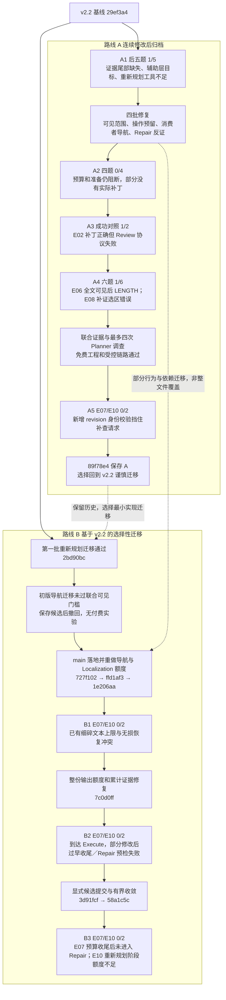
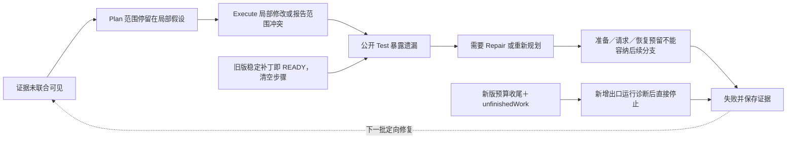

# Devflow v2.2 开发事件图与两条演进路线复盘

截至 2026 年 10 月 8 日，本轮资料覆盖已发布 v2.2 之后的两条代码演进路线、8 个冻结真实实验批次，以及迁移中的免费验收与撤回事件。所有时间按北京时间（Asia/Shanghai）表示；批次时间采用记录完成时间，不混用目录日期和实际运行日期。

**当前主要问题大多在迁移前路线出现过，或者已经存在于 v2.2 的代码中。** 跨层定位不完整、批准范围偏离实际实现、证据展示丢失、重新规划资源不足和过早收尾，都有历史依据。但必须区分“旧代码已有机制”“旧实验实际触发”和“本次修改引入回归”。调查检查点误拒相同源码，以及当前未完成候选在公开诊断后直接停止，是能够明确追溯到新增实现的阻断。

本范围内完成了 **25 次真实完整流程尝试，严格通过 3 次；E07、E10 各尝试 7 次，均未严格通过**。这些尝试跨越不同代码版本、选择性复测和不同难度题目，统计用于复盘，不是 Devflow 的一般成功率，也不能据此计算迁移造成的能力变化。

## 1 版本与统计边界

| 代码身份                                              | 用途与边界                                                                                                                                                                                      |
| ----------------------------------------------------- | ----------------------------------------------------------------------------------------------------------------------------------------------------------------------------------------------- |
| `29ef3a4`，v2.2，包版本 `2.2.0`                       | 发布基线，提交时间 10 月 7 日 19:25。A1 使用此源码；发布前的 E03/E04/E08 和旧 GitHub Issue 验收不计入本文实验总数。                                                                             |
| 路线 A：`codex/pre-v22-migration-20261008`，`89f78e4` | 从 v2.2 连续修改，最终增加可见性状态、跨层导航、Planner 调查等。多批当时未独立提交，10 月 8 日统一保存；因此中间版本按冻结 runtime 身份区分，不能给每批虚构一个 Git 提交。                      |
| 路线 B：当前 `main`，本次审计起点为 `c7cb2db`         | 从 v2.2 重新建立选择性迁移，未整体合入 A 的实现。经过 `2bd90bc`、`ffd1af3`、`1e206aa`、`7c0d0ff`、`3d91fcf`、`58a1c5c` 等实现提交。最新真实测试源码为 `58a1c5c`，后续报告提交未改变该实验源码。 |
| `codex/v2.2-selective-migration`，当前指向 `975fb0d`  | 是 B 路线使用的工作树分支，停在最新 Execute 修复之前。与 main 共享迁移祖先，不作为第三条独立实验路线计数。                                                                                      |

两条路线在 `0de0f8d` 共享发布后报告祖先；回到 v2.2 建立 B 是重新选择代码基线，不是删除 A。A 的代码、历史报告和私有恢复快照均保留。B 通过 `727f102` 落到日常本地主分支，未将 A 的整批未提交改动覆盖回来。

统计只包含发布后的新数据集真实批次 A1–A5、B1–B3。免费受控回放、组件测试、Docker 验收、零费用预检、撤回候选、未启动题目均不算真实修复尝试。实验审计 PASS 表示记录与冻结身份一致，不能替代修复 PASS。私有核心测试、评分代码、标准补丁、凭据和原始请求不进入本文或模型上下文。

## 2 两条路线的事件图

实线表示该路线的实现／实验推进；虚线表示问题反馈或迁移决策，不能解读为整批代码合并。



A 先尝试扩大探索、导航和调查编排；B 则保留 v2.2 的既有调用流程和一次只读补查，选择性迁移准备、导航和额度修复。B 暂未迁入 A 的完整调查状态机、新增公开基准测试阶段、通用 Execute 可见性状态机和那次严格 revision 检查。因而“旧分支解决过某个局部机制”不代表当前主线已经具备其全部行为。

## 3 实验推进与修复结果

### A1 发布后五题暴露原始瓶颈

10 月 7 日 19:52 完成，runtime `89d0dd56f4a6…`，严格 **1/5**。E02 经真实 Test → Repair → Test → Review 成功；E06、E07、E05、E10 失败。

- E06：宿主读到了 379 行源码，但实际请求展示范围不完整；尾部补读又被视作重复探索，无补丁。
- E07：只批准路径辅助函数，行为消费者未覆盖；Repair 后提出其他目标，但重新规划需要／剩余工具为 37／33。
- E05：局部缓存层修改只改善部分场景；重新规划需要／剩余工具为 36／28。
- E10：批准的是 domain 层文件，Execute 认为需要调查 serializer/status-codec 等消费者，没有补丁；重新规划需要／剩余工具为 52／45。

这些重新规划拒绝保护了预算和权限，问题在于前期分配没有保住可执行的后续路径。失败不等于可以绕过保护；提出新路径也不等于已经证明根因。

本批初次审计误用旧的三连败策略，与用户要求五题失败后继续的授权不符；修正审计器读取本批冻结策略后 PASS。生产执行及评分结果未改动，这是实验控制器缺陷，不新增一次案例失败或成功。

### A2 四批修复后困难题仍未闭环

修复实际可见范围及缓存展示、实际操作预留与变更检查点、Localization 动态额度及消费者导航、Repair 失败反证保留。免费 772 项工程测试及相关 Docker 八项通过；旧 P11 时间预算夹具另有失败，不能写成所有入口全通过。

10 月 7 日 21:16 完成，runtime `b187a31c8662…`，严格 **0/4，实际补丁 0/4**：

| 案例 | 真实结果                                       | 修复后仍存在的阻断                                           |
| ---- | ---------------------------------------------- | ------------------------------------------------------------ |
| E06  | 只读补查后仍无修改范围，没有工具调用式 Execute | 定位／规划未收敛；旧尾部问题未被这次完整编辑路径覆盖         |
| E07  | 无修改；公开 test 失败                         | Repair 首次请求 token 预检缺 14,010，没有实际 HTTP           |
| E05  | 无补丁                                         | 探索关闭后模型仍请求编辑，`AUTHORIZATION_HANDOFF_UNRESOLVED` |
| E10  | 有范围冲突，进入准备，无补丁                   | 候选核实耗尽共享八次读取，重新规划请求未发                   |

免费新审批／候选恢复链路可达，并没有转化为这批真实重新规划成功。

### A3 对照实验揭示既有协议脆弱性

未改实现，沿用 A2 runtime，10 月 7 日 21:43 完成。此前成功的 E02、E08 各跑一次，严格 **1/2**。

E08 全流程成功；E02 的补丁、公开测试和全部独立验收通过，Review 却将可选 `symbol` 输出为 null，恢复后又为空字符串，最终 schema 校验失败。相关校验源码与历史成功版本相同：这是此次触发的既有协议脆弱性，不能直接归为新导航改动导致。也不能因为 E08 成功就认定所有能力没有退化。

### A4 修复六次实验问题后出现不同失败表现

三批处理执行收尾／Review 可选字段、规划证据、Repair 预算。10 月 7 日 23:12 完成，runtime `8162dfbaa8a9…`，严格 **1/6**：

| 案例 | 真实结果                                                      | 与之前问题的关系                                                             |
| ---- | ------------------------------------------------------------- | ---------------------------------------------------------------------------- |
| E05  | 范围冲突进入候选准备，但可选导航耗尽读取额度；无重新规划 HTTP | 资源准备未收敛，不能称为范围闭环成功                                         |
| E10  | 只读补查仍未形成可批准修改范围；无工具调用式 Execute          | 证据／规划问题仍在，未覆盖旧 Repair 预算问题                                 |
| E06  | 完整目标源码实际可见，但输出 LENGTH、无补丁                   | 旧尾部可见性问题在此请求已修复；新的失败表现是截断，不能继续归因于尾部不可见 |
| E07  | 初始计划和补查均为只读调查；无工具调用式 Execute              | 更早停止，未验证旧执行／Repair 阻断已经消除                                  |
| E02  | 一次真实 Repair 修复公开失败，Review 补证后 PASS              | 真实闭环成功，但本次未输出空可选字段，不能将成功直接归因于协议归一化         |
| E08  | 全部补丁验收通过，Review 缺证未收敛                           | 要求 `PluginId.parse`，实际只展示转发函数；共享读取未耗尽，反馈轮数耗尽      |

旧观测曾把只读规划补查计入 EXECUTE 指标，因此本文以真实请求用途、工具调用和补丁判断是否进入 Execute，不以阶段指标名称单独判断。

A4 之后另做 E05 免费局部追加：可选导航局部配额耗尽后保留已有证据，原状态由 BLOCKED 变为可构造请求的 READY。读取额度未增加，未新增付费 E05 成功记录。中间 Docker 暴露的缓存初始化顺序和快照 HEAD 身份问题也有修复／复验，但不作为完整流程通过次数。

### A5 完整调查状态机引入生产交接回归

增加累计联合证据、最多四次初始／补查请求、进展停机和按需公开基准观察。免费 810 项测试、Docker 9/9、受控联合证据链路通过。

10 月 8 日 00:36 完成，runtime `44a162a696ab…`，E07、E10 严格 **0/2**。初始 Planner 均完整 UNKNOWN，只读调查获批，但后续模型请求均为零：保存 revision 为 0，benchmark 准备后为 1；repository、base commit、不可变规划源相同，却被新 `PLAN_SOURCE_IDENTITY` 校验拒绝。

**这是明确由新增检查点规则引入的回归。** 免费验收遗漏了启用 benchmark 准备后的 0→1 交接。两题尚未获得后续联合证据，不可归因为证据充分时模型判断错误。随后选择回到 v2.2，保存 A 为 `89f78e4`。

### B0 谨慎迁移先失败一批，再重做落地

第一批将重新规划操作估算、必要证据准备、实际变更检查点等最小实现迁移到 `2bd90bc`，免费最终 773 项工程测试、Docker 8/8 通过。

**初版第二批迁移没有通过联合可见性门槛。** 虽有 66 项组件回归通过，E07 仍缺验证查找函数，E10 仍没有实现和消费者共同可见。候选及回放保存后，六个修改文件撤回到第一批；未启动第三批或真实测试，费用为零。这是验收拒绝的实现尝试，不是另一个两题真实失败批次。

用户要求迁移落实到日常仓库后，以 `727f102` 承接已验收基线；重新实施测试导航顺序、别名／导出／局部辅助关系和跨调用证据保留，提交 `ffd1af3`。再单独修复 Localization 隐藏 8,000 输入门槛、18,000 阶段额度及 12,000 固定下游扣减，提交 `1e206aa`。最终免费 784 项工程测试、Docker 8/8 通过。

A5 的 revision 强等值检查没有迁入。B 用不可变源身份及实际文件 SHA 核实证据，计数变化本身不等于源码变化。免费联合可见结果仍不等于真实模型已定位所有根因，尤其 E10 的完整持久化链未被证明。

### B1 新的探索机会暴露 v2.2 既有输出门槛

10 月 8 日 02:22 完成，runtime `e466acf03698…`，严格 **0/2**，两题均未进入实际 Planner／Execute。

E07 假设说明 548 字符超过 500；E10 摘要 1,018 字符超过 1,000。无损格式修复逐字返回相同超限内容，正常 STOP，配置输出仍为 4,096，未发生 LENGTH。

这些长度限制在 `29ef3a4` 和 A 归档源码中都存在，**不是迁移新增**；A1–A5 没有记录相同长说明阻断。B1 的更多有效证据使其显现。E10 的后续请求仍丢失生产者片段，说明证据连续性也未完全解决。

### B2 输出与证据修复使流程进入 Execute，但后段失败

`7c0d0ff` 取消说明文字的细碎长度门槛，保留整份输出额度、结构和引用校验；累计保存初始证据及有效补读，将宿主持有与实际展示区分。免费 790 项测试、Docker 8/8、旧答复实际 Worker 回放通过。

10 月 8 日 12:37 完成，runtime `32ab50aaa338…`，严格 **0/2**。两题各三次 Localization，完整输出，主 Plan 均接收并进入 Execute：

- E07 Plan 的三个核心修改方向基本正确。Execute 只删 import 后，宿主切换 PATCH_READY、清空步骤且只允许 finishPhase；编译失败。Repair 修了两处 lookup，漏掉另一调用，误称草稿已改。下一 Repair 请求预检所需／剩余 token 为 147,946／146,708。
- E10 实际只修改汇总。事件工厂可见，但其中有正确跳过分支，不能仅凭未修改它断言执行遗漏；完整持久化根因没有进入计划修改范围。首次 Repair 请求预检所需／剩余为 162,888／156,995。

两题均未运行 Review。前期“E10 事件文件已可见，所以模型漏改错误代码”的归因过强，已在当前报告中纠正。

### B3 显式提交修复了状态，但资源与交接仍未闭环

`3d91fcf` 将稳定候选与模型主动提交分开；`58a1c5c` 增加两轮无进展、振荡、恢复期限、未完成项和预算收尾控制，调整重复的 Repair／重新规划 token 分支预留。免费 796 项测试、Docker 8/8、原材料受控 Worker/Docker 回放 2/2 通过。

10 月 8 日 14:02 完成，runtime `c4190074fb9b…`，严格 **0/2**：

- E07 首次仍只删 import，但之后的实际请求保留任务及必要代码、开放精确编辑，模型确实继续修改 lookup。预算预留又在剩余 169,855 token 时关闭编辑。模型准确列出草稿和遗漏调用，宿主记录 NEEDS_MORE_WORK；公开 build 失败。新增未完成候选出口在诊断后直接停止，未使用已预留的 Repair 能力。
- E10 **进入了工具调用式 Execute，实际六次请求**；无补丁，提交范围冲突并进入只读重新规划准备。初始 Plan 仅批准一个未确认事件投影目标，根因范围不足。最终新 Planner 请求所需／剩余阶段额度为 42,934／27,244，缺 15,690，未发请求、未新审批、未运行 Repair／Review。

本轮不存在写入即自动完成，也没有明确结束后继续编辑。两轮停滞／振荡分支未在这两个真实任务中触发，只由免费回归覆盖。完整性均 PASS，但未实现两题修复成功。

## 4 当前问题是否在另一条路线出现过

以下 13 项是复盘用的问题家族，不代表 13 个独立提交，也不将每次复现重复计为新 BUG。

| 家族                                             | A 路线依据                                                      | B 路线依据                                                          | 当前结论及归因                                                                                                      |
| ------------------------------------------------ | --------------------------------------------------------------- | ------------------------------------------------------------------- | ------------------------------------------------------------------------------------------------------------------- |
| F01 关键源码未联合可见／补查丢证                 | A1 E06 尾部；E07/E10 实现、测试、消费者不足                     | B0 初版导航门槛失败；B1 E10 后续丢生产者                            | 局部工程修复有实际请求证据；不代表所有行为链完整定位。已有问题反复显现。                                            |
| F02 修改范围停留在辅助、接口或假设层             | A1 E07/E05/E10；A2/A4 仍未收敛                                  | B2 E10 持久化未定位；B3 仅事件投影假设                              | 明确跨路线复现；定位与模型规划质量仍是主要能力限制。                                                                |
| F03 Localization 探索受隐藏额度压制              | A1 单次收尾及固定额度；A2 单独替换                              | B 从 v2.2 又带回旧限制，第三批再次修复                              | 是基线继承／未迁移造成的再现，不是两次新增长度或额度。当前工程限制已移除，根因召回未保证。                          |
| F04 重新规划工具和源码配额准备不充分             | A1 三题工具不足；A2/A4 共享读取耗尽                             | B0 最小准备迁移；B3 仍达八次读取并需结束可选导航                    | 准备可达与全流程可达不同。缓存／实际操作改进部分验证，仍不能保证剩余资源覆盖新范围。                                |
| F05 阶段 token、恢复和下游预留使流程不可执行     | A2 E07 首个 Repair 差 14,010；A1 有前期预留问题                 | B2 两题 Repair 未派发；B3 E07 编辑窗口关闭、E10 final 预检失败      | 同类问题跨路线持续。保护性预检的拒绝本身正确；分配、请求投影和互斥分支衔接尚未收敛。                                |
| F06 稳定补丁被当作必须结束                       | v2.2/A 源码存在；A1 E07 实际请求出现 READY＋空步骤＋finish-only | B2 E07 实际复现；B3 改为显式提交                                    | 不是迁移新引入。首次写入即强制结束已修复，但预算导致的提前收尾仍在。                                                |
| F07 Execute／Repair 修改不完整或完成声明不符事实 | A1 E02 首次重复完成事件，Repair 成功；E07/E05 局部修改不足      | B2 E07 漏调用、草稿未改；B3 仍首轮删 import                         | 模型决策失败与宿主收尾互相放大。当前交接更诚实，但不能据此宣称修改能力已提高。                                      |
| F08 输出协议及恢复不能兼容真实答复               | A3 E02 Review null→空字符串；校验与历史成功版本相同             | B1 Localization 长说明与无损转换冲突                                | 属于既有协议脆弱性在不同阶段暴露。A 的 Review 归一化与 B 的 Localization 整份预算是不同修复，不可互相冒充。         |
| F09 完整证据下输出仍截断                         | A4 E06 全文已可见，Execute LENGTH                               | 本范围 B 未重新跑 E06                                               | 新失败表现已确认，不能继续归为旧读取问题；未证明由导航修复引入。                                                    |
| F10 Review 补读选错定义却标记完成                | A4 E08 需要 parse，得到转发片段                                 | B 的三批 E07/E10 均未运行 Review                                    | A 上真实暴露，当前主线这两题未覆盖；不能说不存在，也不能将 E07/E10 归为 Review 拒绝。引入因果未单独确认。           |
| F11 调查检查点用 revision 差异误拒相同源码       | A5 两题 PLAN_SOURCE_IDENTITY，无补查请求                        | 该实现未迁入 B；SHA 交接另测                                        | 明确新增回归；B 通过避免迁入并核实源码身份消除该路径，非整体迁入后修补。                                            |
| F12 未完成候选诊断后跳过 Repair                  | A 中没有 B3 的这一新增出口；已有真实 Test→Repair 成功           | B3 E07 有未完成项、Test 诊断，却直接结束                            | 明确新增控制策略缺口。需要消费实际可用修复分支，或在无资源时保存明确阻断。                                          |
| F13 调用／结束原因统计不能代表真实派发与行为     | A2 E07 指标 11，HTTP 10；只读调查曾计入 Execute                 | B2 23 对 21；B3 派发指标 28 对 18，未完成候选归为 INVALID_CANDIDATE | 老的尝试／派发混淆未完全解决；B3 有新的重复计数表现及新增结束分类错误。根因不能只凭汇总字段定性，费用按 HTTP 账本。 |

因此不能回答“当前问题全部是迁移造成的”，也不能回答“全部都是原来的问题”。明确可以由变更定位的新增阻断／分类错误包括 F11 的 revision 校验、F12 的未完成出口、F13 中新增的 termination 分类；派发差异扩大和 Review 选区问题需要进一步隔离具体引入因素。

F06 的源码及历史请求证明旧路线执行过同一强制收尾机制，不证明每次收尾都错误。A1 E07 同时有初始批准范围过窄的问题，不能把其失败全部归给收尾；B2 E07 已批准三个目标却在仅删导入后被限制为结束，才提供了更直接的过早关闭证据。

“读取工具失败”“预算预检拒绝”“越权修改被拒”也不能统一记成新 BUG。必须分别判断：请求是否不合法、保护是否正确、必要证据是否仍可取得、后续分支是否真的能执行。

## 5 统计结果

### 冻结真实批次

| 批次 | 完成时间 北京时间 | 路线／runtime 前缀   | 案例严格结果                       | 尝试／通过 | 实际 HTTP |   新增费用上界 |
| ---- | ----------------- | -------------------- | ---------------------------------- | ---------: | --------: | -------------: |
| A1   | 10-07 19:52       | A／`89d0dd56f4a6`    | E02 PASS；E06/E07/E05/E10 FAIL     |       5／1 |        54 |      ¥5.459802 |
| A2   | 10-07 21:16       | A／`b187a31c8662`    | E06/E07/E05/E10 FAIL               |       4／0 |        28 |      ¥2.695433 |
| A3   | 10-07 21:43       | A／同 A2             | E02 FAIL；E08 PASS                 |       2／1 |        14 |      ¥1.587332 |
| A4   | 10-07 23:12       | A／`8162dfbaa8a9`    | E02 PASS；E05/E10/E06/E07/E08 FAIL |       6／1 |        41 |      ¥5.731252 |
| A5   | 10-08 00:36       | A／`44a162a696ab`    | E07/E10 FAIL                       |       2／0 |         4 |      ¥0.444049 |
| B1   | 10-08 02:22       | B／`e466acf03698`    | E07/E10 FAIL                       |       2／0 |         7 |      ¥0.109858 |
| B2   | 10-08 12:37       | B／`32ab50aaa338`    | E07/E10 FAIL                       |       2／0 |        21 |      ¥1.568098 |
| B3   | 10-08 14:02       | B／`c4190074fb9b`    | E07/E10 FAIL                       |       2／0 |        18 |      ¥1.710263 |
| 合计 | 八个冻结批次      | 不合并为同一实验版本 | 6 个不同案例                       |  **25／3** |   **187** | **¥19.306087** |

| 路线         | 真实批次 | 流程尝试 | 严格通过 | HTTP |   费用上界 |
| ------------ | -------: | -------: | -------: | ---: | ---------: |
| A 含发布基线 |        5 |       19 |        3 |  141 | ¥15.917868 |
| B 选择性迁移 |        3 |        6 |        0 |   46 |  ¥3.388219 |

A 覆盖六个案例，B 只复测最难收敛的 E07/E10，样本选择不同；不能把 3/19 与 0/6 当成公平版本胜负。对于相同 E07/E10，A 为 0/8，B 为 0/6：双方都未建立这两题的成功记录。

| 案例           | A 尝试／通过 | B 尝试／通过 | 本范围合计 | 主要反复问题                                                 |
| -------------- | -----------: | -----------: | ---------: | ------------------------------------------------------------ |
| E02 TaskLite   |         3／2 |         0／0 |       3／2 | 普通执行错误可被 Repair 修复；也会被 Review 协议阻断         |
| E06 LogStream  |         3／0 |         0／0 |       3／0 | 尾部可见性、规划范围、其后 LENGTH，失败原因发生变化          |
| E07 FormStudio |         4／0 |         3／0 |   **7／0** | 跨层目标、预算分配、身份交接、协议、修改／收尾与 Repair 衔接 |
| E05 ConfigTree |         3／0 |         0／0 |       3／0 | 局部缓存假设、授权收尾、重新规划准备额度                     |
| E10 FlowEngine |         4／0 |         3／0 |   **7／0** | 状态／事件／汇总／持久化链定位，以及调查和重新规划资源       |
| E08 PyPlugin   |         2／1 |         0／0 |       2／1 | 补丁正确时 Review 补证仍可能不完整                           |

### 失败终止码与修复尝试

22 次严格失败的工作流终止码如下。它们是停止位置的统计，不是完整根因分类；同一任务可能同时存在证据不足、错误修改和预算压力。

| 终止码                    | 次数 | 不应作出的推论                                                        |
| ------------------------- | ---: | --------------------------------------------------------------------- |
| EXECUTION_BUDGET_EXCEEDED |    9 | 不等于人民币额度用尽；可能是工具、阶段 token 或下游预留               |
| INSUFFICIENT_EVIDENCE     |    6 | 包含定位未收敛、身份误拒和预算后未完成交接，不能全部归为 Localization |
| MODEL_OUTPUT_INVALID      |    3 | A3 一次 Review 协议失败，B1 两次 Localization 协议失败                |
| AGENT_STALLED             |    2 | 一次尾部重复读取，一次授权收尾未解决；不代表所有重复都是真无新证据    |
| LLM_FAILED                |    1 | A4 E06 的 LENGTH，不是已证实的新读取缺陷                              |
| TOOL_FAILED               |    1 | A4 E08 Review 证据未完成，不是补丁已被证明错误                        |

还记录了 **一次未通过门槛而撤回的导航迁移候选**、**一次 E05 局部追加免费修复**。两者都没有新付费成功记录。B 有六个独立实现提交；A 的多个实现批次后来统一归档，因此不能直接用 Git commit 数比较修复次数或效率。

费用计算为八批新增费用相加：¥15.917868＋¥3.388219＝¥19.306087；从发布后实验起点账本 ¥107.586584 承接，至最新 ¥126.892671／¥150。所有 187 个本范围请求均结算；既有未确认占用 ¥1.963125 仍保留。金额是控制器按既定计费规则计算的保守上界，不是平台账单。

## 6 从重复失败中可以确认的演进关系



这条图解释的是已经观察到的工程路径，不是宣称每个实验都经历所有节点。修复前置问题后，后置问题才获得触发机会：B1 的协议失败阻止 Planner；修掉后 B2 才暴露真实修改和 Repair 准入问题；B3 进一步得到准确未完成交接，却暴露“资源预留没有消费到修复分支”的控制缺口。

目前最应保留的结论是：E06 的完整源码展示、Localization 的长说明接收、E07 的写入后继续编辑均有实际证据，不能说所有修复毫无作用；但它们没有形成 E07/E10 的真实闭环成功。继续堆叠约束或将每个 FAIL 都归为模型能力不足，会掩盖宿主分配和交接问题。

后续验收应优先验证三个独立条件：同一行为的必要证据实际进入请求；批准范围覆盖已核实的修改方向；预留后的 Repair／重新规划能够真实派发、执行并回到 Test／Review。任何一项未通过，都保留该项失败，不用另一版本的成功或受控回放替代。

## 7 证据索引与可复核方式

本文统计核对了八批 summary、binding、audit、25 份逐题记录和实际请求；没有新增模型调用或实验。

| 证据               | 身份与用途                                                                                                                                                                                                                                        |
| ------------------ | ------------------------------------------------------------------------------------------------------------------------------------------------------------------------------------------------------------------------------------------------- |
| A 路线原报告       | `89f78e4` 下 `docs/new-dataset-validation-20261007.md`、`docs/new-dataset-problems-20261007.md`、`docs/planner-investigation-validation-20261008.md`；支持 A1–A5 和新增 revision 回归。当前主线同名报告未必包含这些后续章节，应读取归档分支版本。 |
| B 迁移及撤回       | [迁移记录](v22-selective-migration.md)，支持第一批接受、初版第二批撤回、main 落地与重做。                                                                                                                                                         |
| B1 冻结记录        | [迁移真实验收](v22-selective-migration-validation-20261008.md)，支持长度门槛、恢复原样复制及实际未进入 Planner。                                                                                                                                  |
| B2 冻结记录        | [Localization 输出与证据连续性](localization-output-continuity-20261008.md)，支持两题到达 Execute、修改及资源停止，含事后归因纠正。                                                                                                               |
| B3 冻结记录        | [Execute 收尾与真实验收](execute-completion-20261008.md)，支持继续编辑、未完成候选、重新规划预检及实际 HTTP／指标差异。                                                                                                                           |
| 原始实验与统计重算 | Git 忽略目录 `docs/performance/results/new-dataset-v2-2-*`，按统计表八批筛选；本次重算保存在 `.devflow/history-audit/records.json`。不复制到公开 Git。                                                                                            |

归档报告可直接读取，例如：

```text
git show codex/pre-v22-migration-20261008:docs/planner-investigation-validation-20261008.md
git show codex/pre-v22-migration-20261008:docs/new-dataset-validation-20261007.md
```

图中的 A/B 是便于追踪的演进路线标签，不是模型阶段名称。错误归因后续如有新证据，应补充原结论的依据与变更原因，保留冻结结果，不回写历史实验为成功。
